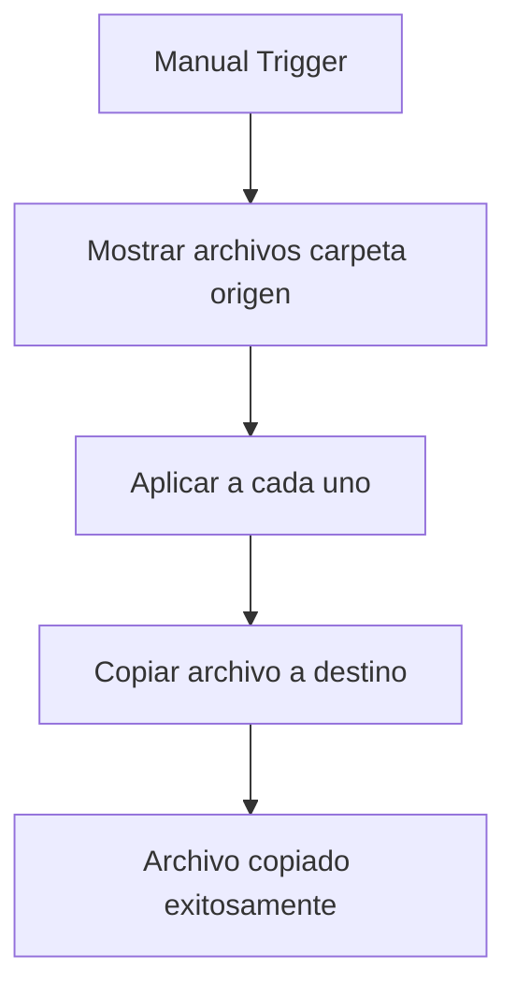
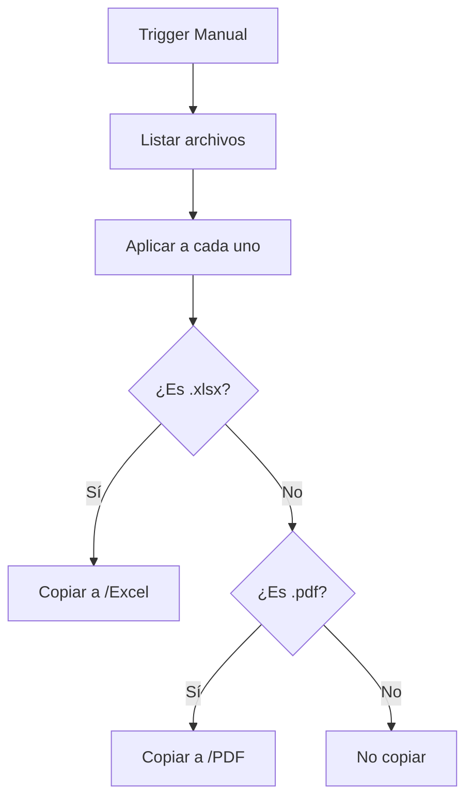
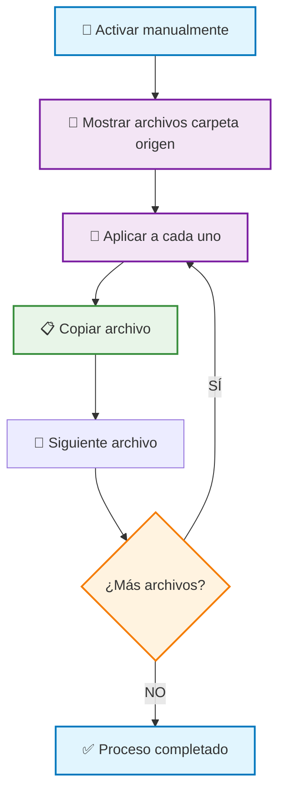

# Copiar Archivos entre Carpetas en OneDrive con Power Automate
## Guía Completa Paso a Paso

---

## 🎯 **Objetivo**
Crear un flujo de Power Automate para **copiar archivos** de una carpeta origen a una carpeta destino en OneDrive para la Empresa de forma automatizada.

## 📋 **Casos de Uso Comunes**
- ✅ **Backup automático** de archivos importantes
- ✅ **Distribución** de archivos a múltiples carpetas
- ✅ **Organización** de documentos por categorías
- ✅ **Duplicación** de archivos para diferentes equipos

---

## 🛠️ **PASOS DETALLADOS DE CONFIGURACIÓN**

### **PASO 1: Crear el Flujo Base**
1. **Ir a Power Automate** → https://make.powerautomate.com
2. **Crear** → **Flujo automatizado**
3. **Nombre del flujo:** `Copiar Archivos OneDrive ADMIN`
4. **Elegir desencadenador:** `Activar manualmente un flujo`
5. **Hacer clic en:** `Crear`

### **PASO 2: Listar Archivos de la Carpeta Origen**
1. **Hacer clic en:** `+ Nuevo paso`
2. **Buscar:** `OneDrive`
3. **Seleccionar:** `OneDrive para la Empresa`
4. **Elegir acción:** `Mostrar los archivos de la carpeta`

**⚙️ Configuración:**
- **Carpeta:** `/ADMIN` (o tu carpeta origen)
- **Incluir subcarpetas:** `No`

### **PASO 3: Aplicar a Cada Archivo**
1. **Hacer clic en:** `+ Nuevo paso`
2. **Buscar:** `control`
3. **Seleccionar:** `Aplicar a cada uno`

**⚙️ Configuración:**
- **Seleccionar una salida de los pasos anteriores:** `value` (del paso "Mostrar los archivos de la carpeta")

### **PASO 4: Copiar el Archivo**
**Dentro del bucle "Aplicar a cada uno":**
1. **Hacer clic en:** `Agregar una acción`
2. **Buscar:** `OneDrive`
3. **Seleccionar:** `OneDrive para la Empresa`
4. **Elegir acción:** `Copiar archivo`

**⚙️ Configuración CRÍTICA:**
- **Archivo:** `Id` (del contenido dinámico "Aplicar a cada uno")
- **Carpeta de destino:** `/ADMIN/COPIADOS` (o tu carpeta destino)
- **Nombre del nuevo archivo:** ⚠️ **DEJAR VACÍO** (para mantener el nombre original)

---

## 📊 **DIAGRAMA DEL FLUJO**



---

## ⚠️ **PARÁMETROS CRÍTICOS - NO FALLAR**

### **1. Referencia del Archivo**
```
🚫 INCORRECTO: Name
🚫 INCORRECTO: {FullPath}
✅ CORRECTO: Id (del contenido dinámico "Aplicar a cada uno")
```

### **2. Input del Bucle**
```
✅ CORRECTO: value (del paso "Mostrar los archivos de la carpeta")
```

### **3. Ruta de Carpeta Destino**
```
✅ CORRECTO: /ADMIN/COPIADOS
✅ CORRECTO: /Documents/Backup
🚫 INCORRECTO: ADMIN/COPIADOS (sin /)
```

### **4. Nombre del Archivo Copiado**
```
✅ PARA MANTENER NOMBRE ORIGINAL: Dejar campo vacío
✅ PARA RENOMBRAR: Escribir nuevo nombre
🚫 INCORRECTO: Usar Name si quieres el nombre original
```

---

## 🔧 **CONFIGURACIÓN AVANZADA**

### **OPCIÓN A: Copia Condicional**
Si quieres copiar solo ciertos archivos, añade una **Condición** después del "Aplicar a cada uno":

1. **Agregar acción:** `Condición`
2. **Configurar:**
   - **Elegir un valor:** `Name` (del contenido dinámico)
   - **Operador:** `contiene`
   - **Valor:** `presupuesto` (o tu criterio)

3. **En "Sí":** Agregar la acción "Copiar archivo"
4. **En "No":** Dejar vacío

### **OPCIÓN B: Copia con Renombrado**
Para cambiar el nombre al copiar:

**En "Nombre del nuevo archivo":**
```
concat('COPIA_', items('Apply_to_each')?['Name'])
```

### **OPCIÓN C: Copia con Fecha**
Para agregar fecha al nombre:
```
concat(formatDateTime(utcNow(), 'yyyy-MM-dd'), '_', items('Apply_to_each')?['Name'])
```

---

## ✅ **CHECKLIST DE VALIDACIÓN**

### **Antes de Ejecutar**
- [ ] ✅ Carpeta origen existe y tiene archivos
- [ ] ✅ Carpeta destino existe
- [ ] ✅ Permisos de acceso a ambas carpetas
- [ ] ✅ Campo "Archivo" usa `Id` (no `Name`)
- [ ] ✅ Campo "Nombre del nuevo archivo" está VACÍO (para mantener nombre original)

### **Durante la Ejecución**
- [ ] ✅ El bucle se ejecuta para cada archivo
- [ ] ✅ No hay errores de "archivo no encontrado"
- [ ] ✅ Los archivos aparecen en la carpeta destino

### **Después de Ejecutar**
- [ ] ✅ Verificar archivos copiados en destino
- [ ] ✅ Archivos originales siguen en origen
- [ ] ✅ Nombres y extensiones correctos

---

## 🚨 **SOLUCIÓN DE ERRORES COMUNES**

### **Error: "Archivo no encontrado"**
**Causa:** Usar `Name` en lugar de `Id`
**Solución:** Cambiar a `Id` en el campo "Archivo"

### **Error: "Carpeta de destino no válida"**
**Causa:** Ruta de carpeta incorrecta
**Solución:** Verificar que la ruta empiece con `/`

### **Error: "Permisos insuficientes"**
**Causa:** Sin acceso a carpetas
**Solución:** Verificar permisos en OneDrive

### **Error: "Archivo ya existe"**
**Causa:** Archivo duplicado en destino
**Solución:** Usar nombres únicos o configurar sobrescritura

---

## 🔄 **VARIACIONES DEL FLUJO**

### **1. Copia Automática por Extensión**


### **2. Copia con Notificación**
Agregar al final:
1. **Nueva acción:** `Enviar un correo electrónico (V2)`
2. **Para:** Tu email
3. **Asunto:** `Archivos copiados exitosamente`
4. **Cuerpo:** `Se han copiado los archivos de ADMIN a COPIADOS`

---

## 📝 **EXPRESIONES ÚTILES**

### **Referencia de Archivo (OBLIGATORIO)**
```
items('Apply_to_each')?['Id']
```

### **Nombre de Archivo**
```
items('Apply_to_each')?['Name']
```

### **Extensión de Archivo**
```
split(items('Apply_to_each')?['Name'], '.')[1]
```

### **Nombre sin Extensión**
```
split(items('Apply_to_each')?['Name'], '.')[0]
```

---

## 🎯 **EJEMPLO PRÁCTICO COMPLETO**

**Flujo para copiar archivos manteniendo nombres originales:**

1. **Trigger:** Manual
2. **Listar:** Archivos de `/ADMIN`
3. **Copiar:** A `/ADMIN/BACKUP`
4. **Mantener:** Nombres originales exactos
5. **Resultado:** Archivos duplicados con nombres idénticos

**Ejemplo:**
- **Origen:** `/ADMIN/presupuesto_2024.xlsx`
- **Destino:** `/ADMIN/BACKUP/presupuesto_2024.xlsx` (mismo nombre)

### **CONFIGURACIÓN ESPECÍFICA PARA MANTENER NOMBRES:**

```
📄 Archivo: Id (del contenido dinámico)
📁 Carpeta de destino: /ADMIN/BACKUP
📝 Nombre del nuevo archivo: [VACÍO] ← ¡IMPORTANTE!
```

**¿Por qué dejar vacío el nombre?**
- Power Automate automáticamente usa el nombre original
- No hay riesgo de errores de escritura
- Es más eficiente y confiable

---

## 🔗 **RECURSOS ADICIONALES**

- [Documentación oficial OneDrive Connector](https://docs.microsoft.com/connectors/onedrive/)
- [Expresiones de Power Automate](https://docs.microsoft.com/power-automate/use-expressions-in-conditions)
- [Solución de problemas OneDrive](https://docs.microsoft.com/power-automate/troubleshoot)

---

## 📞 **SOPORTE**
Si tienes problemas con la implementación:
1. Verificar permisos en OneDrive
2. Revisar expresiones en campos críticos
3. Probar con un solo archivo primero
4. Verificar logs de ejecución en Power Automate
✅ RESULTADO: Flujo creado con desencadenador manual
```

### **PASO 2: Listar Archivos de la Carpeta Origen**
1. **Hacer clic en:** `+ Nuevo paso`
2. **En el buscador escribir:** `OneDrive`
3. **Seleccionar conector:** `OneDrive para la Empresa`
4. **Elegir acción:** `Mostrar los archivos de la carpeta`
5. **Configurar parámetros:**
   ```
   📁 Carpeta ORIGEN: Hacer clic en 📂 → Navegar hasta:
   /SENA/CDFPI/PRESUPUESTO/nuve/ADMIN/nueva
   ```

```
✅ RESULTADO: Acción configurada para obtener lista de archivos origen
```

### **PASO 3: Crear Bucle "Aplicar a cada uno"**
1. **Hacer clic en:** `+ Nuevo paso`
2. **En el buscador escribir:** `Control`
3. **Seleccionar:** `Control` (icono de engranaje)
4. **Elegir acción:** `Aplicar a cada uno`
5. **Configurar entrada:**
   ```
   📋 Seleccionar una salida de los pasos anteriores:
   - Hacer clic en el campo de entrada
   - Seleccionar: body/value (de "Mostrar los archivos de la carpeta")
   ```

```
⚠️ CRÍTICO: Debes seleccionar "body/value", NO solo "value"
✅ RESULTADO: Bucle configurado para iterar sobre cada archivo
```

### **PASO 4: Copiar Archivo - DENTRO del Bucle**

⚠️ **MUY IMPORTANTE:** Este paso se hace DENTRO del bucle "Aplicar a cada uno"

1. **Dentro del bucle, hacer clic en:** `+ Agregar una acción`
2. **En el buscador escribir:** `OneDrive`
3. **Seleccionar:** `OneDrive para la Empresa`
4. **Elegir acción:** `Copiar archivo`
5. **Configurar parámetros:**
   ```
   📄 Archivo: Hacer clic en 🧪 (expresión) y escribir:
   items('Apply_to_each')?['Id']
   
   📁 Carpeta de destino: Hacer clic en 📂 → Navegar hasta:
   /SENA/CDFPI/PRESUPUESTO/nuve/ADMIN/backup
   
   📝 Nuevo nombre (opcional): Dejar vacío para mantener nombre original
   ```

```
✅ RESULTADO: Cada archivo será copiado a la carpeta destino
```

---

## 🔧 **CONFIGURACIONES ESPECÍFICAS CORRECTAS**

### **🧪 Expresiones Exactas para Copiar:**

#### **Campo "Archivo" (obligatorio):**
```javascript
items('Apply_to_each')?['Id']
```

#### **Campo "Carpeta de destino" (obligatorio):**
```
/SENA/CDFPI/PRESUPUESTO/nuve/ADMIN/backup
```

#### **Campo "Nuevo nombre" (opcional):**
```
// Opción 1: Mantener nombre original (dejar vacío)

// Opción 2: Agregar prefijo
concat('BACKUP_', items('Apply_to_each')?['Name'])

// Opción 3: Agregar fecha
concat(formatDateTime(utcNow(), 'yyyy-MM-dd'), '_', items('Apply_to_each')?['Name'])

// Opción 4: Cambiar extensión
replace(items('Apply_to_each')?['Name'], '.xlsx', '_backup.xlsx')
```

### **📋 Pasos para Insertar Expresiones:**
1. **Hacer clic en el campo correspondiente**
2. **Hacer clic en el botón 🧪** (expresión)
3. **Escribir/pegar la expresión exacta**
4. **Hacer clic en:** `Aceptar`

---

## 🎯 **ESTRUCTURA VISUAL DEL FLUJO**



---

## 🛡️ **VERSIÓN AVANZADA CON CONDICIONES**

### **COPIAR SOLO ARCHIVOS ESPECÍFICOS**

Si quieres copiar solo ciertos tipos de archivos:

#### **PASO 4 ALTERNATIVO: Agregar Condición Antes de Copiar**
1. **Dentro del bucle, hacer clic en:** `+ Agregar una acción`
2. **Buscar:** `Control`
3. **Elegir acción:** `Condición`
4. **Configurar condición de ejemplo:**
   ```
   🔍 Lado izquierdo: Hacer clic en 🧪 y escribir:
   contains(items('Apply_to_each')?['Name'], '.xlsx')
   
   📊 Operador: seleccionar "es igual a"
   
   📝 Lado derecho: escribir: true
   ```

#### **PASO 5: Copiar Solo en Rama "Sí"**
1. **En la rama "Sí" de la condición:**
   - Agregar acción: `OneDrive para la Empresa`
   - Acción: `Copiar archivo`
   - Archivo: `items('Apply_to_each')?['Id']`
   - Carpeta destino: `/ruta/destino`

2. **En la rama "No":**
   - No agregar ninguna acción (omitir archivo)

```
✅ RESULTADO: Solo copia archivos que cumplan la condición
```

---

## 🧪 **EXPRESIONES ÚTILES PARA CONDICIONES**

### **Copiar archivos por extensión:**
```javascript
// Solo archivos Excel
contains(items('Apply_to_each')?['Name'], '.xlsx')

// Solo archivos PDF
contains(items('Apply_to_each')?['Name'], '.pdf')

// Solo archivos Word
contains(items('Apply_to_each')?['Name'], '.docx')

// Múltiples extensiones
or(
  contains(items('Apply_to_each')?['Name'], '.xlsx'),
  contains(items('Apply_to_each')?['Name'], '.pdf')
)
```

### **Copiar archivos por fecha:**
```javascript
// Archivos modificados hoy
equals(formatDateTime(items('Apply_to_each')?['LastModified'], 'yyyy-MM-dd'), formatDateTime(utcNow(), 'yyyy-MM-dd'))

// Archivos de los últimos 7 días
greater(items('Apply_to_each')?['LastModified'], addDays(utcNow(), -7))

// Archivos del mes actual
equals(formatDateTime(items('Apply_to_each')?['LastModified'], 'yyyy-MM'), formatDateTime(utcNow(), 'yyyy-MM'))
```

### **Copiar archivos por nombre:**
```javascript
// Archivos que contienen "CDP"
contains(toLower(items('Apply_to_each')?['Name']), 'cdp')

// Archivos que empiezan con "LISTADO"
startsWith(items('Apply_to_each')?['Name'], 'LISTADO')

// Archivos que terminan con fecha
endsWith(items('Apply_to_each')?['Name'], '2025.xlsx')
```

### **Copiar archivos por tamaño:**
```javascript
// Archivos mayores a 1MB (1048576 bytes)
greater(items('Apply_to_each')?['Size'], 1048576)

// Archivos menores a 5MB
less(items('Apply_to_each')?['Size'], 5242880)
```

---

## 📁 **CONFIGURACIONES DE CARPETAS COMUNES**

### **Rutas de Ejemplo:**
```
🗂️ CARPETA ORIGEN:
/SENA/CDFPI/PRESUPUESTO/nuve/ADMIN/nueva

🗂️ CARPETAS DESTINO:
/SENA/CDFPI/PRESUPUESTO/nuve/ADMIN/backup
/SENA/CDFPI/PRESUPUESTO/nuve/ADMIN/procesados
/SENA/CDFPI/PRESUPUESTO/nuve/ADMIN/historico
/SENA/CDFPI/PRESUPUESTO/nuve/ADMIN/compartidos
```

### **Estrategias de Organización:**
```
📅 POR FECHA:
/backup/2025/06/12

📂 POR TIPO:
/backup/excel
/backup/pdf
/backup/word

🏷️ POR CATEGORÍA:
/backup/CDP
/backup/RP
/backup/PAGO

👥 POR DEPARTAMENTO:
/backup/ADMIN
/backup/CONTABILIDAD
/backup/PRESUPUESTO
```

---

## 🔄 **FLUJO AVANZADO: COPIAR CON ESTRUCTURA DE CARPETAS**

### **CREAR CARPETAS POR FECHA AUTOMÁTICAMENTE**

#### **PASO 4A: Crear Variable de Fecha**
1. **Dentro del bucle, agregar:** `Control` → `Inicializar variable`
2. **Configurar:**
   ```
   📝 Nombre: fechaHoy
   📊 Tipo: Cadena
   💡 Valor: formatDateTime(utcNow(), 'yyyy-MM-dd')
   ```

#### **PASO 4B: Crear Carpeta de Destino Dinámica**
1. **Agregar:** `OneDrive para la Empresa` → `Crear carpeta`
2. **Configurar:**
   ```
   📁 Ruta principal: /SENA/CDFPI/PRESUPUESTO/nuve/ADMIN/backup
   📝 Nombre de carpeta: variables('fechaHoy')
   ```

#### **PASO 4C: Copiar a Carpeta Dinámica**
1. **Agregar:** `OneDrive para la Empresa` → `Copiar archivo`
2. **Configurar:**
   ```
   📄 Archivo: items('Apply_to_each')?['Id']
   📁 Destino: concat('/SENA/CDFPI/PRESUPUESTO/nuve/ADMIN/backup/', variables('fechaHoy'))
   ```

---

## ⚠️ **CONSIDERACIONES IMPORTANTES**

### **🔒 Permisos Necesarios:**
- ✅ **Lectura** en carpeta origen
- ✅ **Escritura** en carpeta destino
- ✅ **Creación de carpetas** (si usas rutas dinámicas)

### **💾 Gestión del Espacio:**
- ⚠️ **Duplicación:** Los archivos copiados ocupan espacio adicional
- 📊 **Límites:** OneDrive tiene límites de almacenamiento
- 🗑️ **Limpieza:** Considerar eliminación periódica de backups antiguos

### **🚀 Performance:**
- ⚙️ **Simultaneidad:** Configurar en "Aplicar a cada uno"
- ⏱️ **Timeouts:** Ajustar para archivos grandes
- 📈 **Límites API:** OneDrive tiene límites de operaciones por minuto

---

## ✅ **CHECKLIST DE VALIDACIÓN**

### **Antes de ejecutar:**
- [ ] ✅ Flujo probado con 1-2 archivos de prueba
- [ ] ✅ Carpeta destino existe y es accesible
- [ ] ✅ Campo "Archivo" usa expresión `items('Apply_to_each')?['Id']`
- [ ] ✅ Bucle "Aplicar a cada uno" usa entrada `body/value`
- [ ] ✅ Ruta de carpeta destino es correcta
- [ ] ✅ Permisos de escritura verificados

### **Durante la ejecución:**
- [ ] ✅ Monitorear progreso en historial de flujo
- [ ] ✅ Verificar que no hay errores de permisos
- [ ] ✅ Confirmar que archivos se copian correctamente

### **Después de ejecutar:**
- [ ] ✅ Verificar archivos en carpeta destino
- [ ] ✅ Confirmar que archivos origen se mantienen intactos
- [ ] ✅ Validar que nombres y contenido son correctos
- [ ] ✅ Documentar resultado de la operación

---

## 🚨 **SOLUCIÓN DE PROBLEMAS COMUNES**

### **Error: "File not found"**
**Causa:** Expresión incorrecta en campo "Archivo"
**Solución:** Usar `items('Apply_to_each')?['Id']` en lugar de `Name` o `FullPath`

### **Error: "Path not found"**
**Causa:** Carpeta destino no existe
**Solución:** Crear carpeta manualmente o agregar acción "Crear carpeta"

### **Error: "Access denied"**
**Causa:** Sin permisos de escritura en destino
**Solución:** Verificar permisos en OneDrive para la carpeta destino

### **Error: "Duplicate name"**
**Causa:** Archivo ya existe en destino
**Solución:** Usar campo "Nuevo nombre" con timestamp o sufijo único

### **Error: "Apply_to_each referenced by inputs are not defined"**
**Causa:** Acción "Copiar archivo" fuera del bucle
**Solución:** Mover la acción DENTRO del "Aplicar a cada uno"

---

## 🎯 **EJEMPLOS PRÁCTICOS COMUNES**

### **EJEMPLO 1: Backup Diario Simple**
```
📁 Origen: /ADMIN/nueva
📁 Destino: /ADMIN/backup
🔄 Frecuencia: Diaria
📝 Nombre: Original (sin cambios)
```

### **EJEMPLO 2: Organización por Tipo**
```
📁 Origen: /ADMIN/nueva
📁 Destino: Dinámico según extensión
  ├─ Excel → /ADMIN/excel
  ├─ PDF → /ADMIN/pdf
  └─ Word → /ADMIN/word
```

### **EJEMPLO 3: Backup con Fecha**
```
📁 Origen: /ADMIN/nueva
📁 Destino: /ADMIN/backup/2025-06-12
📝 Nombre: 2025-06-12_nombreoriginal.xlsx
```

---

## 🎯 **RESUMEN EJECUTIVO**

**Para copiar archivos correctamente en OneDrive con Power Automate:**

1. **📁 Listar archivos** con "Mostrar los archivos de la carpeta"
2. **🔄 Iterar** con "Aplicar a cada uno" usando `body/value`
3. **📋 Copiar** con "Copiar archivo" usando:
   - **Archivo:** `items('Apply_to_each')?['Id']`
   - **Destino:** Ruta completa de la carpeta destino
4. **🛡️ Opcional:** Agregar condiciones para filtrar archivos
5. **✅ Probar** siempre con archivos de ejemplo primero

**¡La clave está en usar el ID del archivo, no el Name o FullPath!**
