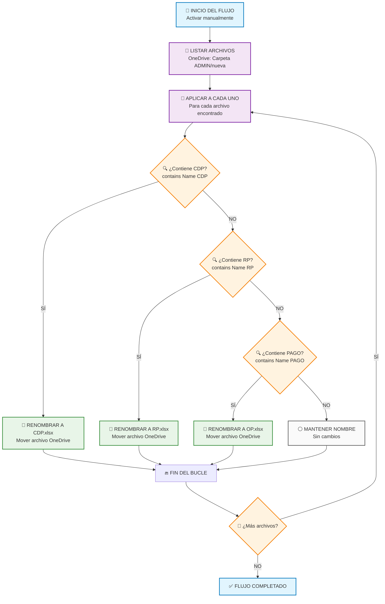
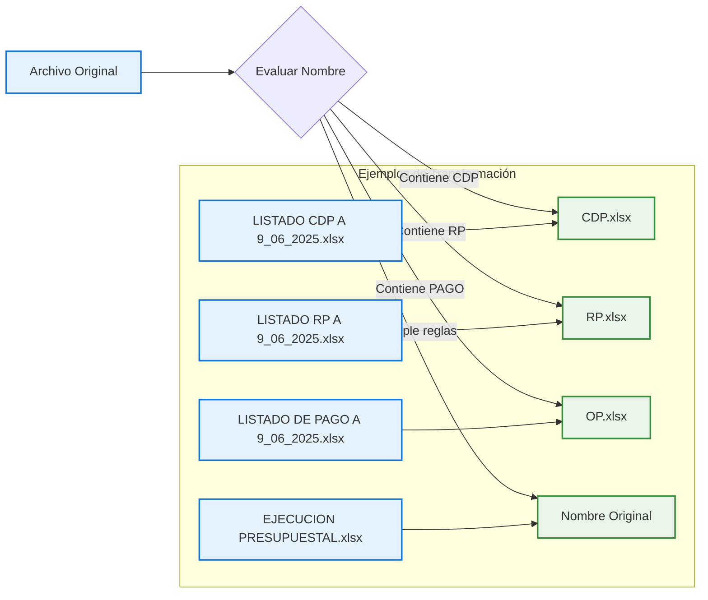
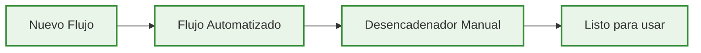
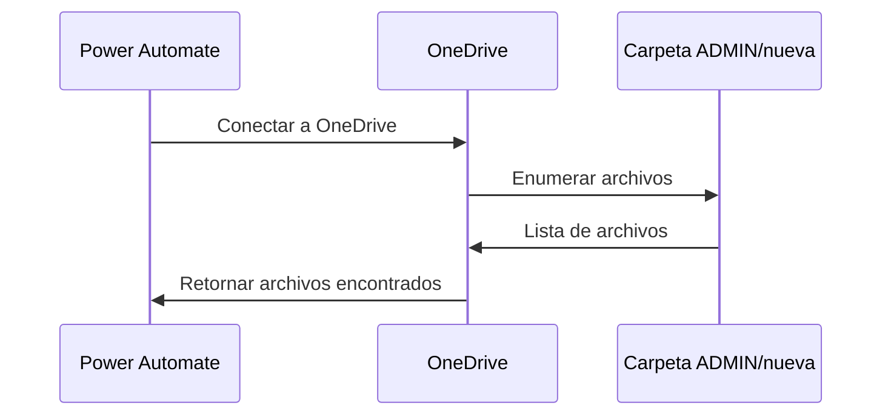
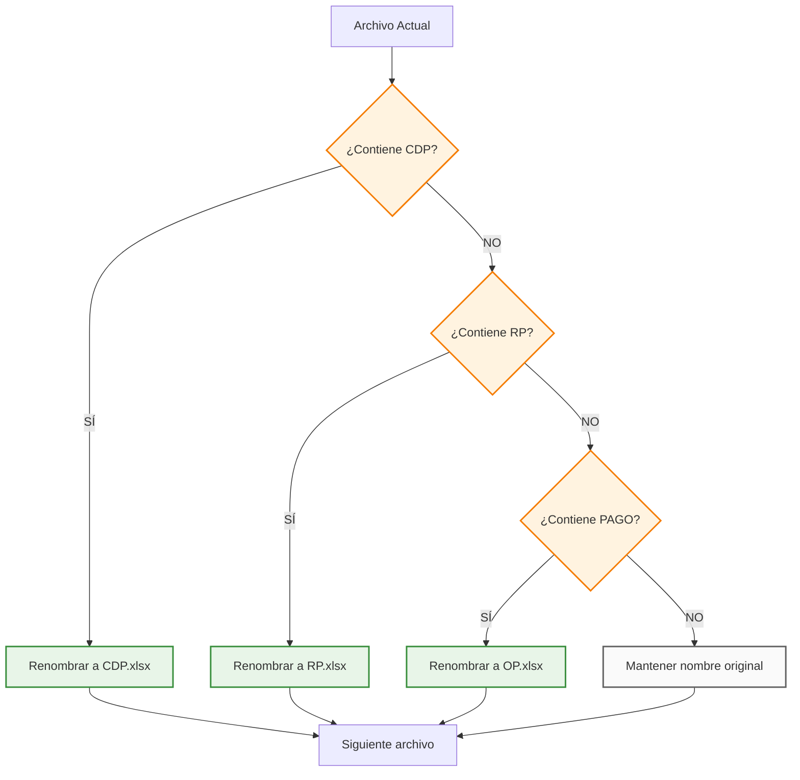
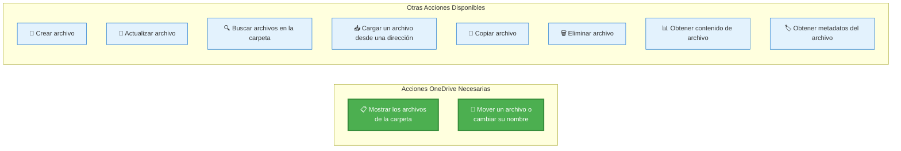
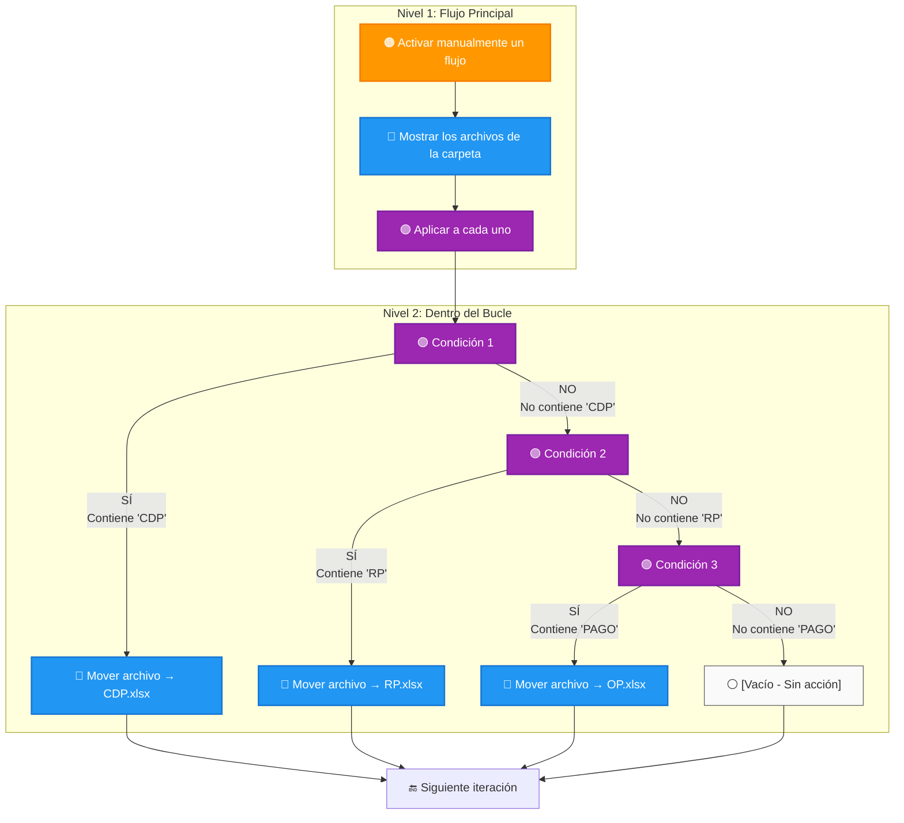

# Diagrama de Flujo Completo - Power Automate
## Renombrado Automático de Archivos de Presupuesto (OneDrive)

---

## 📋 CONFIGURACIÓN INICIAL DEL FLUJO

**Nombre del Flujo:** `Renombrar Archivos Presupuesto ADMIN`
**Tipo:** Flujo de nube automatizado
**Conector:** OneDrive para la Empresa
**Desencadenador:** Manual (botón) o Programado

---

## 🔄 DIAGRAMA DE FLUJO PRINCIPAL



---

## 🎯 DIAGRAMA DE LÓGICA DE RENOMBRADO



---

## 🛠️ PASOS DETALLADOS DE CONFIGURACIÓN

### **PASO 1: Configurar el Desencadenador**
1. **Crear nuevo flujo** → "Flujo de nube automatizado"
2. **Nombre:** "Renombrar Archivos Presupuesto ADMIN"
3. **Desencadenador:** "Activar manualmente un flujo" (para pruebas)
   - O "Periodicidad" (para automatización)



### **PASO 2: Obtener Archivos de OneDrive**
1. **Agregar nueva acción** → Buscar "OneDrive"
2. **Seleccionar:** "Enumerar archivos de la carpeta"
3. **Configuración:**
   ```
   Carpeta: /SENA/CDFPI/PRESUPUESTO/nuve/ADMIN/nueva
   ```



### **PASO 3: Crear Bucle Para Cada Archivo**
1. **Agregar nueva acción** → Buscar "Control"
2. **Seleccionar:** "Aplicar a cada uno"
3. **Configuración:**
   ```
   Seleccionar una salida de los pasos anteriores: value
   ```

### **PASO 4-6: Condiciones Anidadas**



#### **Configuración Detallada de Condiciones:**

**Condición 1 - CDP:**
```javascript
// Expresión de condición
contains(items('Apply_to_each')?['Name'], 'CDP')

// Acción en rama SÍ: Mover archivo
Conector: OneDrive para la Empresa
Acción: "Mover archivo"
Archivo: items('Apply_to_each')?['{FullPath}']
Carpeta de destino: /SENA/CDFPI/PRESUPUESTO/nuve/ADMIN/nueva
Nuevo nombre: CDP.xlsx
```

**Condición 2 - RP:**
```javascript
// Expresión de condición
contains(items('Apply_to_each')?['Name'], 'RP')

// Acción en rama SÍ: Mover archivo
Archivo: items('Apply_to_each')?['{FullPath}']
Nuevo nombre: RP.xlsx
```

**Condición 3 - PAGO:**
```javascript
// Expresión de condición
contains(items('Apply_to_each')?['Name'], 'PAGO')

// Acción en rama SÍ: Mover archivo
Archivo: items('Apply_to_each')?['{FullPath}']
Nuevo nombre: OP.xlsx
```

---

## 🔧 EXPRESIONES Y CONFIGURACIONES OneDrive

### **Para referencia del archivo actual:**
```javascript
items('Apply_to_each')?['Name']          // Nombre del archivo
items('Apply_to_each')?['{FullPath}']    // Ruta completa OneDrive
items('Apply_to_each')?['Id']            // ID único del archivo
items('Apply_to_each')?['Size']          // Tamaño del archivo
```

### **Para construir rutas de destino OneDrive:**
```javascript
// Concatenar ruta base con nuevo nombre
concat('/SENA/CDFPI/PRESUPUESTO/nuve/ADMIN/nueva/', 'CDP.xlsx')
concat('/SENA/CDFPI/PRESUPUESTO/nuve/ADMIN/nueva/', 'RP.xlsx')
concat('/SENA/CDFPI/PRESUPUESTO/nuve/ADMIN/nueva/', 'OP.xlsx')
```

### **Expresiones de condiciones mejoradas:**
```javascript
// Búsqueda insensible a mayúsculas/minúsculas
contains(toLower(items('Apply_to_each')?['Name']), 'cdp')
contains(toLower(items('Apply_to_each')?['Name']), 'rp')
contains(toLower(items('Apply_to_each')?['Name']), 'pago')
```

### **Validación de archivos Excel:**
```javascript
// Verificar que sea archivo Excel
and(
  contains(items('Apply_to_each')?['Name'], '.xlsx'),
  contains(items('Apply_to_each')?['Name'], 'CDP')
)
```

---

## 📁 ACCIONES ESPECÍFICAS DE ONEDRIVE DISPONIBLES

Basado en las opciones que mostraste, aquí están las acciones exactas que necesitamos:

### **ACCIONES QUE USAREMOS EN NUESTRO FLUJO:**



### **1. "Mostrar los archivos de la carpeta"**
```
┌─────────────────────────────────────────────────────────────┐
│ 🎯 PROPÓSITO: Obtener lista de archivos de una carpeta     │
│                                                             │
│ 📍 CONFIGURACIÓN:                                          │
│   ├─ Carpeta: /SENA/CDFPI/PRESUPUESTO/nuve/ADMIN/nueva    │
│   └─ Resultado: Array "value" con información de archivos  │
│                                                             │
│ 📤 SALIDA: Lista de archivos con propiedades:             │
│   ├─ Name: Nombre del archivo                              │
│   ├─ FullPath: Ruta completa                              │
│   ├─ Id: Identificador único                              │
│   ├─ Size: Tamaño del archivo                             │
│   └─ LastModified: Fecha de modificación                  │
└─────────────────────────────────────────────────────────────┘
```

### **2. "Mover un archivo o cambiar su nombre"**
```
┌─────────────────────────────────────────────────────────────┐
│ 🎯 PROPÓSITO: Renombrar o mover archivos                   │
│                                                             │
│ 📍 CONFIGURACIÓN:                                          │
│   ├─ Archivo: [Expresión] items('Apply_to_each')?['{FullPath}'] │
│   ├─ Carpeta de destino: /SENA/CDFPI/PRESUPUESTO/nuve/ADMIN/nueva │
│   └─ Nuevo nombre: CDP.xlsx (o RP.xlsx, OP.xlsx)          │
│                                                             │
│ ⚠️ IMPORTANTE:                                             │
│   ├─ Si cambias solo el nombre, mantén la misma carpeta   │
│   ├─ Si existe archivo con mismo nombre, puede fallar     │
│   └─ OneDrive mantiene versiones anteriores               │
└─────────────────────────────────────────────────────────────┘
```

---

## 🏗️ ESTRUCTURA REAL DEL FLUJO EN POWER AUTOMATE



---

## 🔧 CONFIGURACIÓN PASO A PASO CON CAPTURAS

### **PASO 1: Desencadenador**
```
1. Ir a Power Automate → Crear → Flujo automatizado
2. Nombre: "Renombrar Archivos Presupuesto ADMIN"
3. Buscar: "manual"
4. Seleccionar: "Activar manualmente un flujo"
5. Clic en "Crear"

✅ Resultado: Aparece caja naranja con título del desencadenador
```

### **PASO 2: Acción OneDrive - Listar Archivos**
```
1. Clic en "+ Nuevo paso"
2. Buscar: "OneDrive"
3. Seleccionar: "OneDrive para la Empresa"
4. Buscar acción: "Mostrar los archivos de la carpeta"
5. En "Carpeta": escribir o navegar a:
   /SENA/CDFPI/PRESUPUESTO/nuve/ADMIN/nueva

✅ Resultado: Aparece caja azul con el conector OneDrive
```

### **PASO 3: Control - Aplicar a cada uno**
```
1. Clic en "+ Nuevo paso"
2. Buscar: "Control"
3. Seleccionar: "Aplicar a cada uno"
4. En "Seleccionar una salida de los pasos anteriores":
   - Clic en el campo
   - Seleccionar "value" (aparece automáticamente)

✅ Resultado: Aparece caja morada que contiene otros elementos
```

### **PASO 4: Primera Condición (CDP)**
```
1. DENTRO del bucle "Aplicar a cada uno":
   - Clic en "Agregar una acción"
2. Buscar: "Control"
3. Seleccionar: "Condición"
4. Configurar:
   - Lado izquierdo: Clic en "Expresión"
   - Escribir: contains(items('Apply_to_each')?['Name'], 'CDP')
   - Operador: "es igual a"
   - Lado derecho: true

✅ Resultado: Se crea condición con dos ramas (Sí/No)
```

### **PASO 5: Acción en Rama "SÍ"**
```
1. En la rama "Sí" de la condición:
   - Clic en "Agregar una acción"
2. Buscar: "OneDrive"
3. Seleccionar: "Mover un archivo o cambiar su nombre"
4. Configurar:
   - Archivo: Clic en "Expresión"
   - Escribir: items('Apply_to_each')?['{FullPath}']
   - Carpeta de destino: /SENA/CDFPI/PRESUPUESTO/nuve/ADMIN/nueva
   - Nuevo nombre: CDP.xlsx

✅ Resultado: Acción de renombrado en rama positiva
```

### **PASO 6: Condición Anidada en Rama "NO"**
```
1. En la rama "No" de la primera condición:
   - Clic en "Agregar una acción"
2. Repetir proceso de condición
3. Expresión: contains(items('Apply_to_each')?['Name'], 'RP')

✅ Resultado: Segunda condición anidada dentro de la primera
```

---

## ❓ PREGUNTAS FRECUENTES

### **P: ¿Por qué no veo las ramas SÍ/NO al principio?**
**R:** Las ramas aparecen **automáticamente** cuando agregas una **Condición**. No tienes que crearlas manualmente.

### **P: ¿Qué pasa si no agrego nada en la rama "NO"?**
**R:** El flujo **continúa normalmente**. Es perfectamente válido dejar una rama vacía.

### **P: ¿Puedo probar el flujo sin archivos reales?**
**R:** Sí, pero necesitas al menos **acceso a la carpeta** de OneDrive. Puedes crear archivos de prueba con nombres como "test CDP.xlsx".

### **P: ¿Qué significa "items('Apply_to_each')"?**
**R:** Es la referencia al **archivo actual** en el bucle. Power Automate la genera automáticamente.
