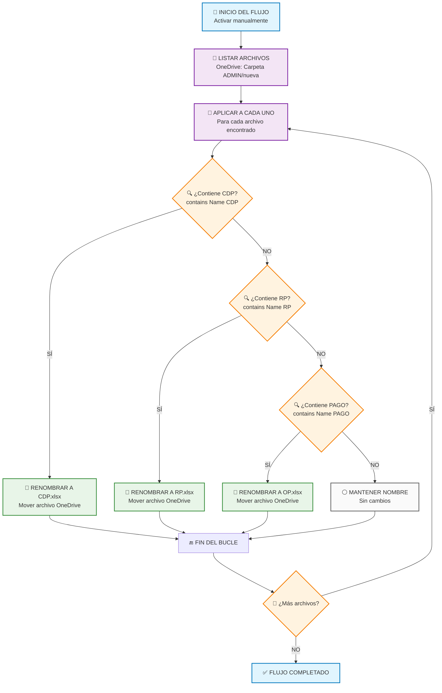
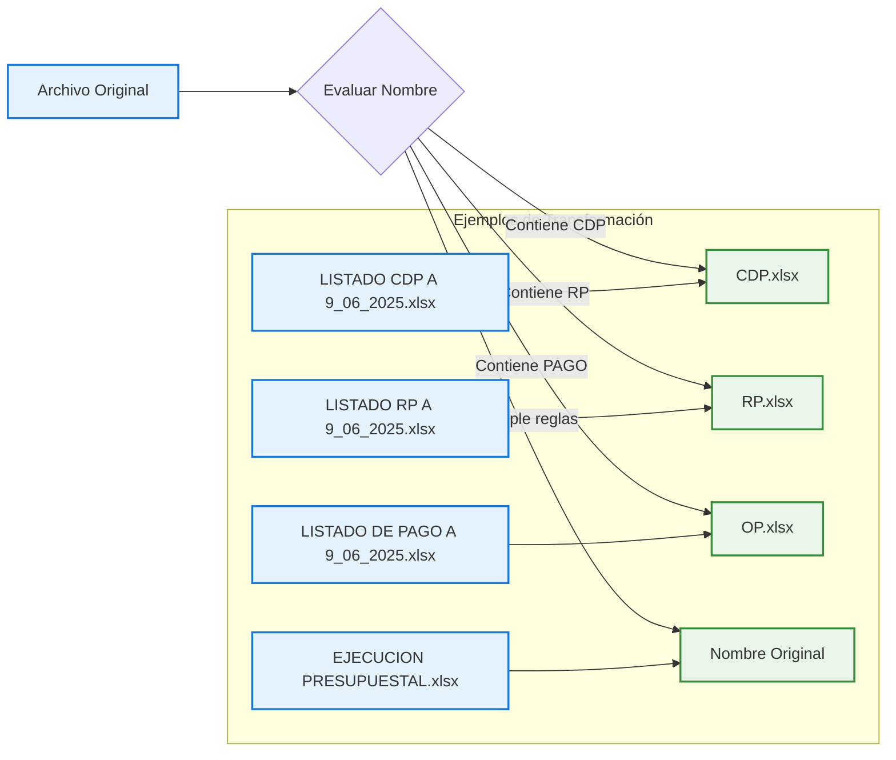
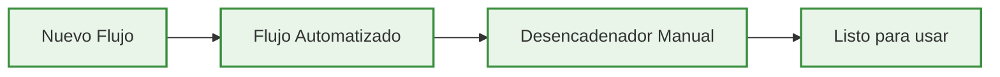
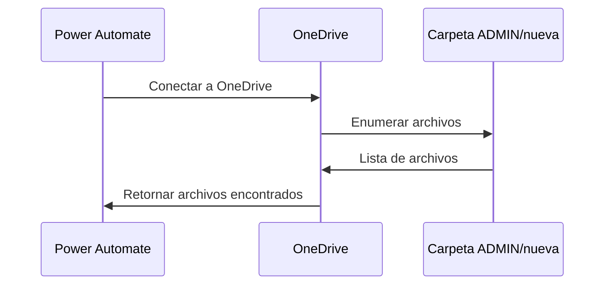
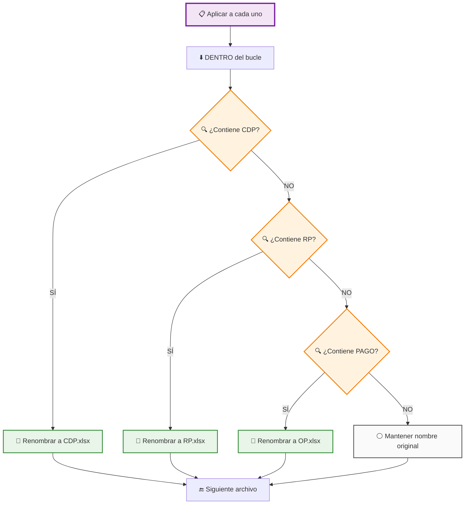
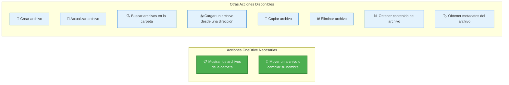

# Diagrama de Flujo Completo - Power Automate
## Renombrado Automático de Archivos de Presupuesto (OneDrive)

---

## 📋 CONFIGURACIÓN INICIAL DEL FLUJO

**Nombre del Flujo:** `Renombrar Archivos Presupuesto ADMIN`
**Tipo:** Flujo de nube automatizado
**Conector:** OneDrive para la Empresa
**Desencadenador:** Manual (botón) o Programado

---

## 🔄 DIAGRAMA DE FLUJO PRINCIPAL



---

## 🎯 DIAGRAMA DE LÓGICA DE RENOMBRADO



---

## 🛠️ PASOS DETALLADOS DE CONFIGURACIÓN

### **PASO 1: Configurar el Desencadenador**
1. **Crear nuevo flujo** → "Flujo de nube automatizado"
2. **Nombre:** "Renombrar Archivos Presupuesto ADMIN"
3. **Desencadenador:** "Activar manualmente un flujo" (para pruebas)
   - O "Periodicidad" (para automatización)



### **PASO 2: Obtener Archivos de OneDrive**
1. **Agregar nueva acción** → Buscar "OneDrive"
2. **Seleccionar:** "Mostrar los archivos de la carpeta"
3. **Configuración:**
   ```
   Carpeta: /SENA/CDFPI/PRESUPUESTO/nuve/ADMIN/nueva
   ```



### **PASO 3: Crear Bucle Para Cada Archivo**
1. **Agregar nueva acción** → Buscar "Control"
2. **Seleccionar:** "Aplicar a cada uno"
3. **Configuración:**
   ```
   Seleccionar una salida de los pasos anteriores: body/value
   ```
   
   ⚠️ **IMPORTANTE:** En la interfaz verás "body/value" (no solo "value")
   - Esto es porque Power Automate muestra la estructura completa del objeto
   - "body/value" contiene el array de archivos de OneDrive
   - Es la selección correcta para iterar sobre los archivos

### **PASO 4-6: Condiciones Anidadas**

⚠️ **MUY IMPORTANTE:** Las condiciones DEBEN estar DENTRO del bucle "Aplicar a cada uno"



### **🚨 ERROR COMÚN: "Apply_to_each referenced by inputs are not defined"**

**CAUSA:** La condición está FUERA del bucle "Aplicar a cada uno"
**SOLUCIÓN:** 
1. ❌ Eliminar condición mal ubicada
2. ✅ Crear condición DENTRO del bucle
3. ✅ Hacer clic en "+" DENTRO de "Aplicar a cada uno"

#### **Configuración Detallada de Condiciones:**

⚠️ **UBICACIÓN CRÍTICA:** Todas las condiciones deben estar DENTRO del "Aplicar a cada uno"

**Condición 1 - CDP:** (DENTRO del bucle)
```javascript
// PASO 1: Hacer clic en "+" DENTRO de "Aplicar a cada uno"
// PASO 2: Agregar acción → Control → Condición
// PASO 3: Configurar expresión de condición:
contains(items('Apply_to_each')?['Name'], 'CDP')

// PASO 4: En rama SÍ, agregar acción OneDrive:
Conector: OneDrive para la Empresa
Acción: "Mover un archivo o cambiar su nombre"
Archivo: items('Apply_to_each')?['{FullPath}']
Ruta de destino: /SENA/CDFPI/PRESUPUESTO/nuve/ADMIN/nueva/CDP.xlsx
```

**Condición 2 - RP:**
```javascript
// Expresión de condición
contains(items('Apply_to_each')?['Name'], 'RP')

// Acción en rama SÍ: Mover archivo
Archivo: items('Apply_to_each')?['{FullPath}']
Nuevo nombre: RP.xlsx
```

**Condición 3 - PAGO:**
```javascript
// Expresión de condición
contains(items('Apply_to_each')?['Name'], 'PAGO')

// Acción en rama SÍ: Mover archivo
Archivo: items('Apply_to_each')?['{FullPath}']
Nuevo nombre: OP.xlsx
```

---

## 🔧 EXPRESIONES Y CONFIGURACIONES OneDrive

### **Para referencia del archivo actual:**
```javascript
items('Apply_to_each')?['Name']          // Nombre del archivo
items('Apply_to_each')?['{FullPath}']    // Ruta completa OneDrive
items('Apply_to_each')?['Id']            // ID único del archivo
items('Apply_to_each')?['Size']          // Tamaño del archivo
```

### **Para construir rutas de destino OneDrive:**
```javascript
// Concatenar ruta base con nuevo nombre
concat('/SENA/CDFPI/PRESUPUESTO/nuve/ADMIN/nueva/', 'CDP.xlsx')
concat('/SENA/CDFPI/PRESUPUESTO/nuve/ADMIN/nueva/', 'RP.xlsx')
concat('/SENA/CDFPI/PRESUPUESTO/nuve/ADMIN/nueva/', 'OP.xlsx')
```

### **Expresiones de condiciones mejoradas:**
```javascript
// Búsqueda insensible a mayúsculas/minúsculas
contains(toLower(items('Apply_to_each')?['Name']), 'cdp')
contains(toLower(items('Apply_to_each')?['Name']), 'rp')
contains(toLower(items('Apply_to_each')?['Name']), 'pago')
```

### **Validación de archivos Excel:**
```javascript
// Verificar que sea archivo Excel
and(
  contains(items('Apply_to_each')?['Name'], '.xlsx'),
  contains(items('Apply_to_each')?['Name'], 'CDP')
)
```

---

## 📁 ACCIONES ESPECÍFICAS DE ONEDRIVE DISPONIBLES

Basado en las opciones que mostraste, aquí están las acciones exactas que necesitamos:

### **ACCIONES QUE USAREMOS EN NUESTRO FLUJO:**



### **1. "Mostrar los archivos de la carpeta"**
```
┌─────────────────────────────────────────────────────────────┐
│ 🎯 PROPÓSITO: Obtener lista de archivos de una carpeta     │
│                                                             │
│ 📍 CONFIGURACIÓN:                                          │
│   ├─ Carpeta: /SENA/CDFPI/PRESUPUESTO/nuve/ADMIN/nueva    │
│   └─ Resultado: Array "value" con información de archivos  │
│                                                             │
│ 📤 SALIDA: Lista de archivos con propiedades:             │
│   ├─ Name: Nombre del archivo                              │
│   ├─ FullPath: Ruta completa                              │
│   ├─ Id: Identificador único                              │
│   ├─ Size: Tamaño del archivo                             │
│   └─ LastModified: Fecha de modificación                  │
└─────────────────────────────────────────────────────────────┘
```

### **2. "Mover un archivo o cambiar su nombre"**
```
┌─────────────────────────────────────────────────────────────┐
│ 🎯 PROPÓSITO: Renombrar o mover archivos                   │
│                                                             │
│ 📍 CONFIGURACIÓN:                                          │
│   ├─ Archivo: [Expresión] items('Apply_to_each')?['{FullPath}'] │
│   ├─ Carpeta de destino: /SENA/CDFPI/PRESUPUESTO/nuve/ADMIN/nueva │
│   └─ Nuevo nombre: CDP.xlsx (o RP.xlsx, OP.xlsx)          │
│                                                             │
│ ⚠️ IMPORTANTE:                                             │
│   ├─ Si cambias solo el nombre, mantén la misma carpeta   │
│   ├─ Si existe archivo con mismo nombre, puede fallar     │
│   └─ OneDrive mantiene versiones anteriores               │
└─────────────────────────────────────────────────────────────┘
```

---

## 📝 ACCIONES COMPLETAS DE ONEDRIVE DISPONIBLES

Aquí tienes **todas las acciones disponibles** en OneDrive para la Empresa en Power Automate:

### **📁 GESTIÓN DE ARCHIVOS:**
- ✅ **"Mostrar los archivos de la carpeta"** ← **(USAMOS ESTA)**
- ✅ **"Mover un archivo o cambiar su nombre"** ← **(USAMOS ESTA)**
- 📄 "Crear archivo"
- 🔄 "Actualizar archivo"
- 🗑️ "Eliminar archivo"
- 📋 "Copiar archivo"

### **🔍 BÚSQUEDA Y NAVEGACIÓN:**
- 🔍 "Buscar archivos en la carpeta"
- 🔍 "Buscar archivos en la carpeta por ruta de acceso"
- 📁 "Mostrar los archivos de la carpeta raíz"

### **📤 CARGA Y DESCARGA:**
- ⬇️ "Cargar un archivo desde una dirección URL"
- 📊 "Obtener contenido de archivo"
- 📊 "Obtener contenido de archivo mediante ruta de acceso"

### **🔗 VÍNCULOS Y METADATOS:**
- 🔗 "Crear un vínculo para compartir"
- 🔗 "Crear un vínculo para compartir por ruta de acceso"
- 🏷️ "Obtener metadatos del archivo"
- 🏷️ "Obtener metadatos de archivo mediante ruta de acceso"
- 🖼️ "Obtener la miniatura del archivo"

### **🔄 CONVERSIÓN Y PROCESAMIENTO:**
- 🔄 "Convertir un archivo" (Vista previa)
- 🔄 "Convertir un archivo mediante una ruta de acceso" (Vista previa)
- 📦 "Extraer archivo a carpeta"

### **📂 OPERACIONES CON RUTAS:**
- 📝 "Copiar un archivo mediante una ruta de acceso"
- 📝 "Mover un archivo o cambiar su nombre mediante una ruta de acceso"

---

## ✅ CONFIRMACIÓN DE ACCIONES PARA NUESTRO FLUJO

Para nuestro flujo específico **solo necesitamos 2 acciones**:

### **1. 📋 "Mostrar los archivos de la carpeta"**
```
🎯 Propósito: Obtener lista de todos los archivos en la carpeta
📍 Configuración: Especificar ruta de la carpeta
📤 Salida: Array "value" con información de cada archivo
```

### **2. 📝 "Mover un archivo o cambiar su nombre"**
```
🎯 Propósito: Renombrar archivos específicos
📍 Configuración: 
   ├─ Archivo: Ruta del archivo actual
   ├─ Carpeta de destino: Misma carpeta (para renombrar)
   └─ Nuevo nombre: CDP.xlsx, RP.xlsx, OP.xlsx
```

### **🚫 Acciones que NO necesitamos:**
- ❌ "Buscar archivos en la carpeta" (ya tenemos la lista completa)
- ❌ "Obtener metadatos" (ya incluidos en "Mostrar archivos")
- ❌ "Crear archivo" (solo renombramos existentes)
- ❌ "Eliminar archivo" (solo cambiamos nombres)

---
