# Diagrama de Flujo Completo - Power Automate
## Renombrado Automático de Archivos de Presupuesto (OneDrive)

---

## 📋 CONFIGURACIÓN INICIAL DEL FLUJO

**Nombre del Flujo:** `Renombrar Archivos Presupuesto ADMIN`
**Tipo:** Flujo de nube automatizado
**Conector:** OneDrive para la Empresa
**Desencadenador:** Manual (botón) o Programado

---

## 🔄 DIAGRAMA DE FLUJO PRINCIPAL

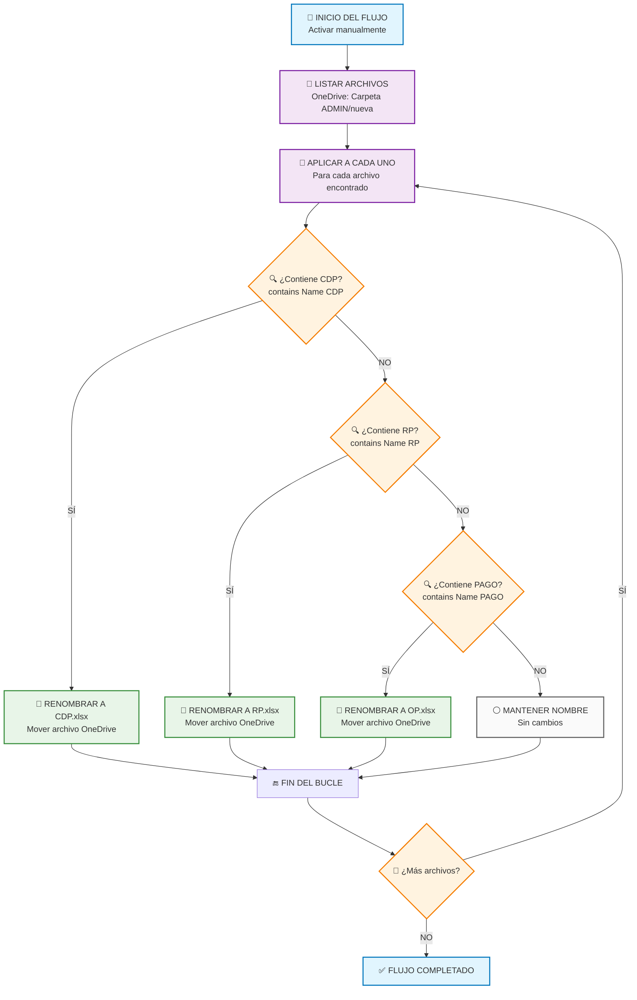

---

## 🎯 DIAGRAMA DE LÓGICA DE RENOMBRADO

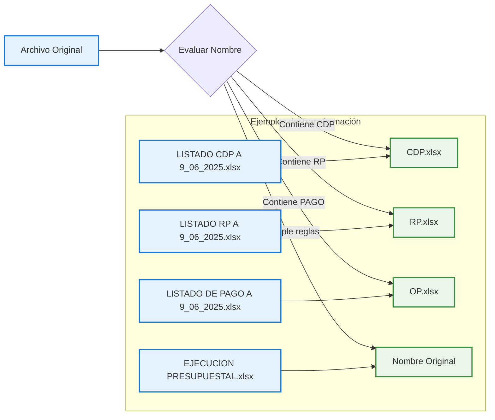

---

## 🛠️ PASOS DETALLADOS DE CONFIGURACIÓN

### **PASO 1: Configurar el Desencadenador**
1. **Crear nuevo flujo** → "Flujo de nube automatizado"
2. **Nombre:** "Renombrar Archivos Presupuesto ADMIN"
3. **Desencadenador:** "Activar manualmente un flujo" (para pruebas)
   - O "Periodicidad" (para automatización)

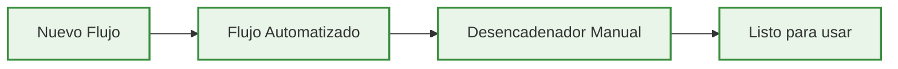

### **PASO 2: Obtener Archivos de OneDrive**
1. **Agregar nueva acción** → Buscar "OneDrive"
2. **Seleccionar:** "Enumerar archivos de la carpeta"
3. **Configuración:**
   ```
   Carpeta: /SENA/CDFPI/PRESUPUESTO/nuve/ADMIN/nueva
   ```

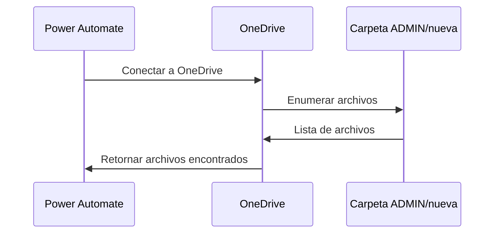

### **PASO 3: Crear Bucle Para Cada Archivo**
1. **Agregar nueva acción** → Buscar "Control"
2. **Seleccionar:** "Aplicar a cada uno"
3. **Configuración:**
   ```
   Seleccionar una salida de los pasos anteriores: value
   ```

### **PASO 4-6: Condiciones Anidadas**

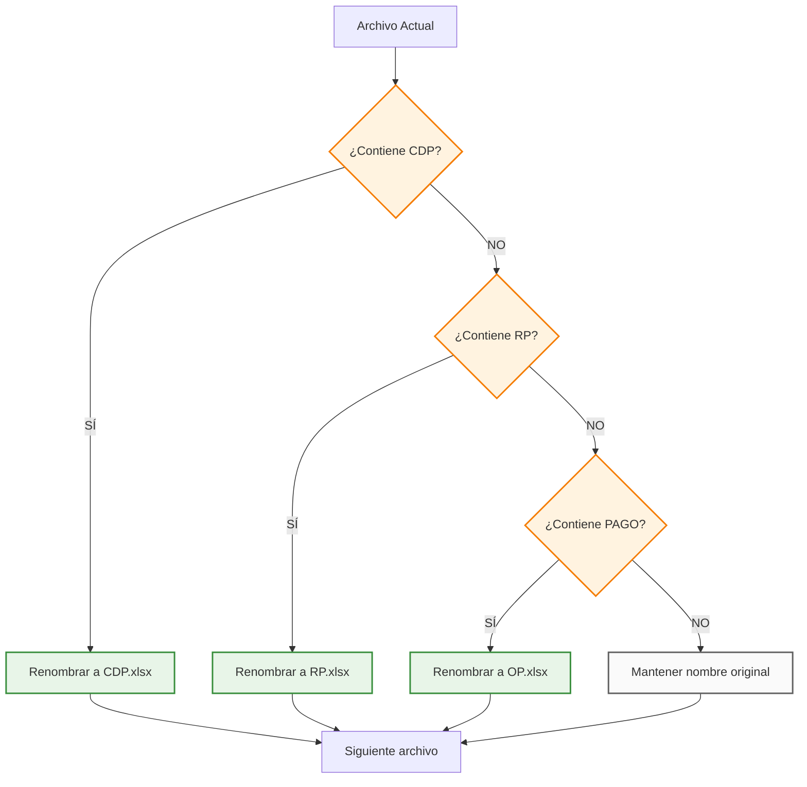

#### **Configuración Detallada de Condiciones:**

**Condición 1 - CDP:**
```javascript
// Expresión de condición
contains(items('Apply_to_each')?['Name'], 'CDP')

// Acción en rama SÍ: Mover archivo
Conector: OneDrive para la Empresa
Acción: "Mover archivo"
Archivo: items('Apply_to_each')?['{FullPath}']
Carpeta de destino: /SENA/CDFPI/PRESUPUESTO/nuve/ADMIN/nueva
Nuevo nombre: CDP.xlsx
```

**Condición 2 - RP:**
```javascript
// Expresión de condición
contains(items('Apply_to_each')?['Name'], 'RP')

// Acción en rama SÍ: Mover archivo
Archivo: items('Apply_to_each')?['{FullPath}']
Nuevo nombre: RP.xlsx
```

**Condición 3 - PAGO:**
```javascript
// Expresión de condición
contains(items('Apply_to_each')?['Name'], 'PAGO')

// Acción en rama SÍ: Mover archivo
Archivo: items('Apply_to_each')?['{FullPath}']
Nuevo nombre: OP.xlsx
```

---

## 🔧 EXPRESIONES Y CONFIGURACIONES OneDrive

### **Para referencia del archivo actual:**
```javascript
items('Apply_to_each')?['Name']          // Nombre del archivo
items('Apply_to_each')?['{FullPath}']    // Ruta completa OneDrive
items('Apply_to_each')?['Id']            // ID único del archivo
items('Apply_to_each')?['Size']          // Tamaño del archivo
```

### **Para construir rutas de destino OneDrive:**
```javascript
// Concatenar ruta base con nuevo nombre
concat('/SENA/CDFPI/PRESUPUESTO/nuve/ADMIN/nueva/', 'CDP.xlsx')
concat('/SENA/CDFPI/PRESUPUESTO/nuve/ADMIN/nueva/', 'RP.xlsx')
concat('/SENA/CDFPI/PRESUPUESTO/nuve/ADMIN/nueva/', 'OP.xlsx')
```

### **Expresiones de condiciones mejoradas:**
```javascript
// Búsqueda insensible a mayúsculas/minúsculas
contains(toLower(items('Apply_to_each')?['Name']), 'cdp')
contains(toLower(items('Apply_to_each')?['Name']), 'rp')
contains(toLower(items('Apply_to_each')?['Name']), 'pago')
```

### **Validación de archivos Excel:**
```javascript
// Verificar que sea archivo Excel
and(
  contains(items('Apply_to_each')?['Name'], '.xlsx'),
  contains(items('Apply_to_each')?['Name'], 'CDP')
)
```

---

## 📊 DIAGRAMA DE RESULTADOS ESPERADOS

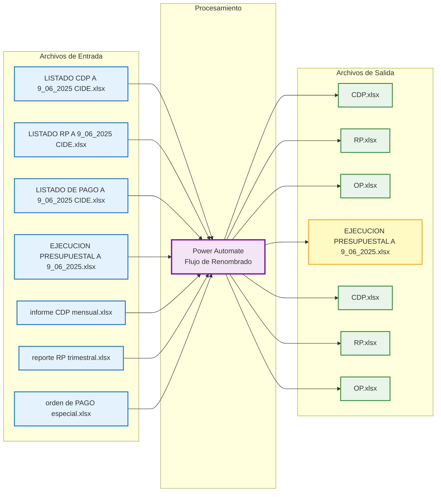

---

## ⚙️ CONFIGURACIONES AVANZADAS OneDrive

### **Configuración de Manejo de Errores:**
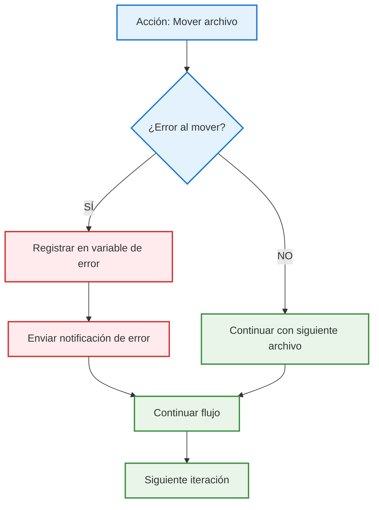

### **Configuración de Concurrencia:**
1. En "Aplicar a cada uno", clic en "..." → "Configuración"
2. **Control de simultaneidad:** Activado
3. **Grado de paralelismo:** 1 (para evitar conflictos en OneDrive)

### **Configuración de Tiempo de Espera:**
- **Tiempo de espera:** 5 minutos por archivo
- **Reintentos:** 3 intentos en caso de fallo
- **Intervalo entre reintentos:** 30 segundos

---

## 🚨 CONSIDERACIONES IMPORTANTES OneDrive

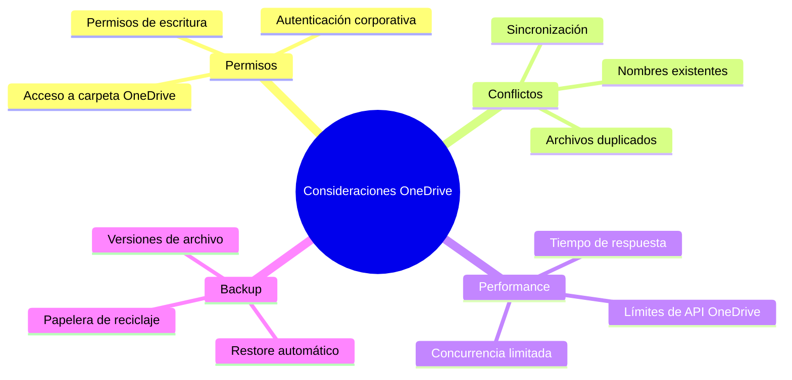

### **Puntos Críticos:**
1. **Orden de Prioridad:** CDP → RP → PAGO (evaluación secuencial)
2. **Sobreescritura:** OneDrive puede mantener versiones anteriores
3. **Permisos:** Necesario acceso completo a la carpeta OneDrive
4. **Límites:** API de OneDrive tiene limitaciones de velocidad
5. **Backup:** OneDrive mantiene papelera de reciclaje automática

---

## 🧪 PROCESO DE PRUEBA Y VALIDACIÓN

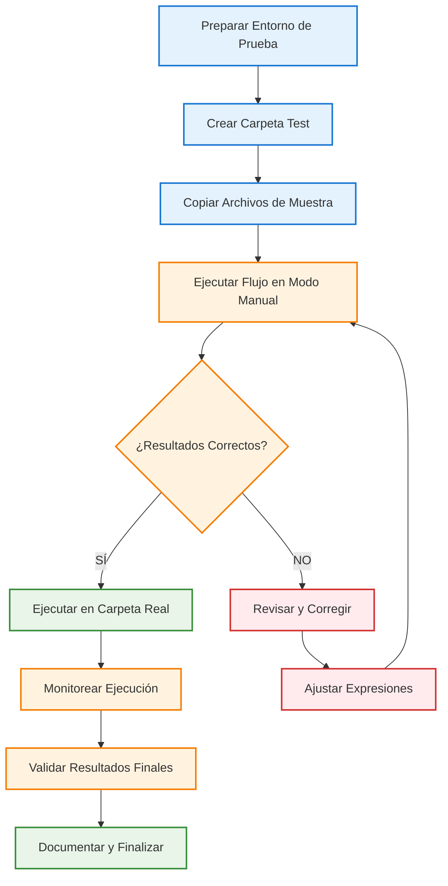

### **Lista de Verificación de Pruebas:**
- [ ] Crear carpeta `/test/ADMIN/nueva` en OneDrive
- [ ] Subir archivos de prueba con diferentes patrones de nombres
- [ ] Ejecutar flujo manualmente
- [ ] Verificar que archivos se renombren correctamente
- [ ] Comprobar que archivos sin patrones se mantengan iguales
- [ ] Revisar logs de ejecución en Power Automate
- [ ] Confirmar que no hay errores de permisos
- [ ] Validar manejo de archivos duplicados

---

## 📈 MONITOREO Y MÉTRICAS

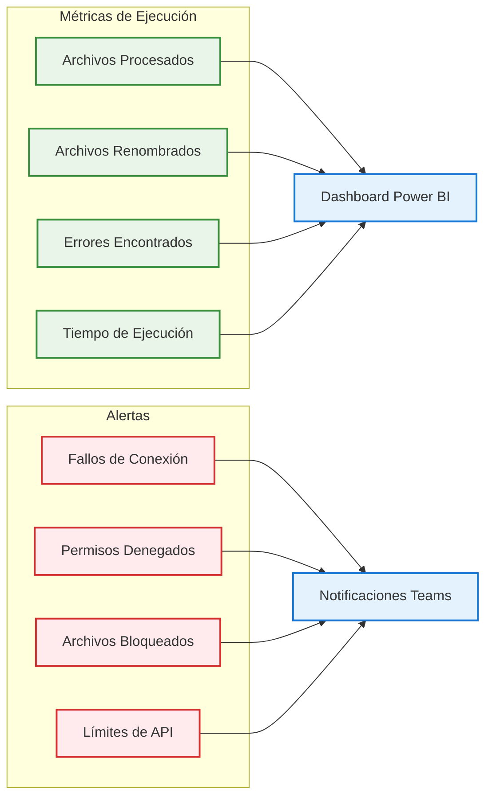

---

## 🔄 DIAGRAMA DE ARQUITECTURA DEL FLUJO

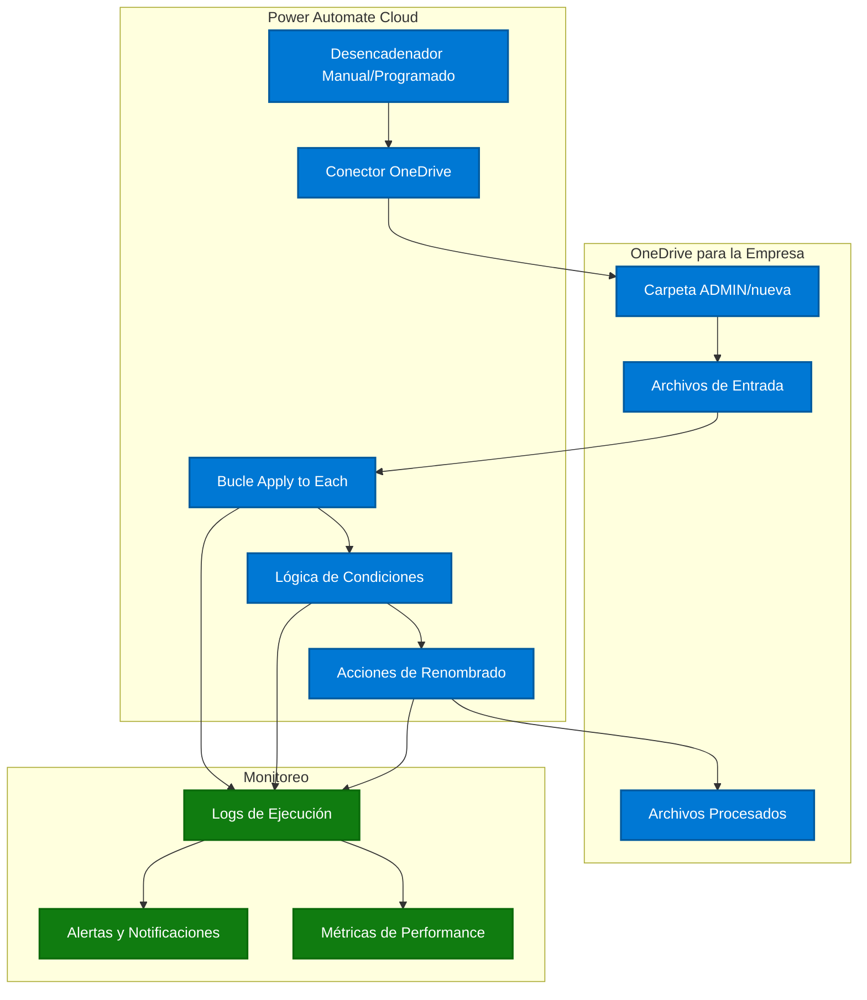

---

## 📊 TABLA DE RESULTADOS ESPERADOS

| Archivo Original | Archivo Renombrado | Condición Aplicada | Estado |
|------------------|-------------------|-------------------|---------|
| LISTADO CDP A 9_06_2025 CIDE.xlsx | CDP.xlsx | Contiene "CDP" | ✅ Renombrado |
| LISTADO RP A 9_06_2025 CIDE.xlsx | RP.xlsx | Contiene "RP" | ✅ Renombrado |
| LISTADO DE PAGO A 9_06_2025 CIDE.xlsx | OP.xlsx | Contiene "PAGO" | ✅ Renombrado |
| EJECUCION PRESUPUESTAL A 9_06_2025.xlsx | [Sin cambios] | No cumple condiciones | ⚪ Mantenido |
| informe CDP mensual.xlsx | CDP.xlsx | Contiene "CDP" | ✅ Renombrado |
| reporte RP trimestral.xlsx | RP.xlsx | Contiene "RP" | ✅ Renombrado |
| orden de PAGO especial.xlsx | OP.xlsx | Contiene "PAGO" | ✅ Renombrado |
| análisis financiero.xlsx | [Sin cambios] | No cumple condiciones | ⚪ Mantenido |

---

## 🎯 FLUJO COMPLETO RESUMIDO

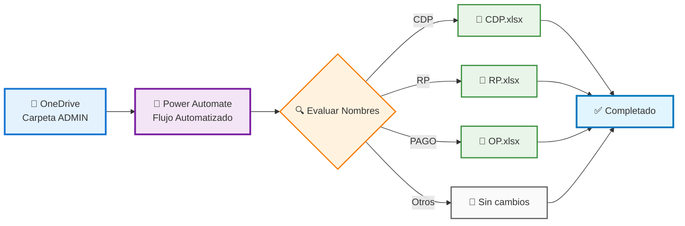

---

## 📋 CHECKLIST DE IMPLEMENTACIÓN

### **Antes de Implementar:**
- [ ] ✅ Verificar permisos de OneDrive para la Empresa
- [ ] ✅ Confirmar acceso a la carpeta `/SENA/CDFPI/PRESUPUESTO/nuve/ADMIN/nueva`
- [ ] ✅ Crear carpeta de prueba para validación
- [ ] ✅ Preparar archivos de muestra con nombres representativos
- [ ] ✅ Configurar autenticación en Power Automate

### **Durante la Implementación:**
- [ ] ⚡ Crear el flujo con el desencadenador manual
- [ ] ⚡ Configurar conector OneDrive para la Empresa
- [ ] ⚡ Agregar acción "Enumerar archivos de la carpeta"
- [ ] ⚡ Configurar bucle "Aplicar a cada uno"
- [ ] ⚡ Implementar condiciones anidadas (CDP → RP → PAGO)
- [ ] ⚡ Configurar acciones de "Mover archivo" para cada condición
- [ ] ⚡ Establecer configuraciones de error y concurrencia

### **Después de Implementar:**
- [ ] 🧪 Ejecutar pruebas en carpeta de test
- [ ] 🧪 Validar que todos los archivos se procesen correctamente
- [ ] 🧪 Verificar manejo de errores y casos límite
- [ ] 🧪 Comprobar logs de ejecución
- [ ] 📊 Configurar monitoreo y alertas
- [ ] 📚 Documentar procedimiento para usuarios finales

---

**📅 Fecha de creación:** 11 de junio de 2025  
**📊 Versión:** 2.0 (Actualizada para OneDrive + Diagramas Mermaid)  
**✅ Estado:** Listo para implementación  
**👨‍💻 Autor:** Documentación técnica Power Automate  
**🔧 Tecnologías:** Power Automate, OneDrive para la Empresa, Mermaid Diagrams
