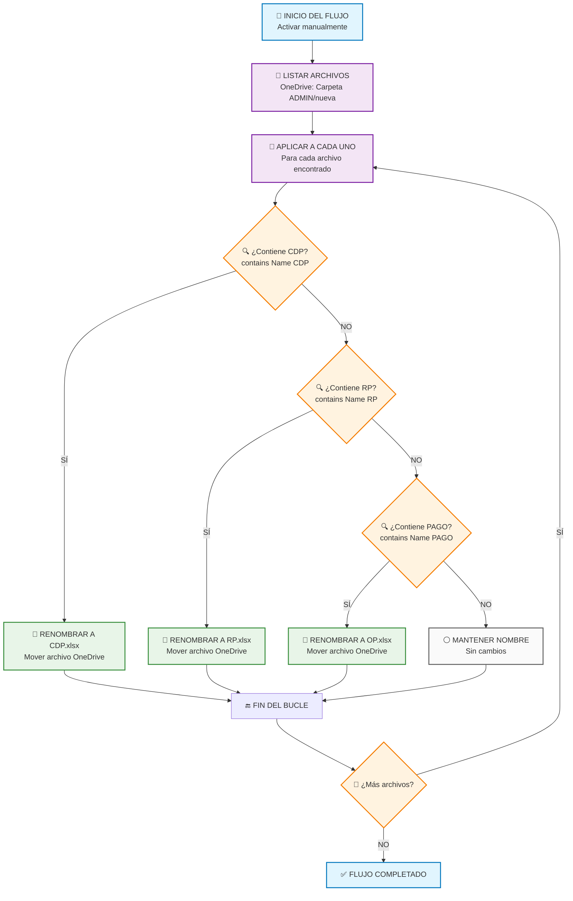
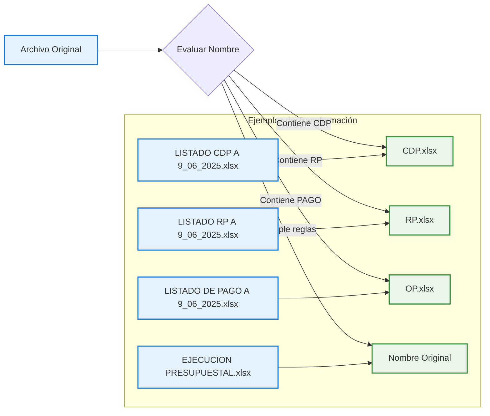
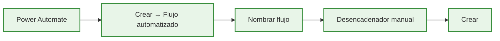
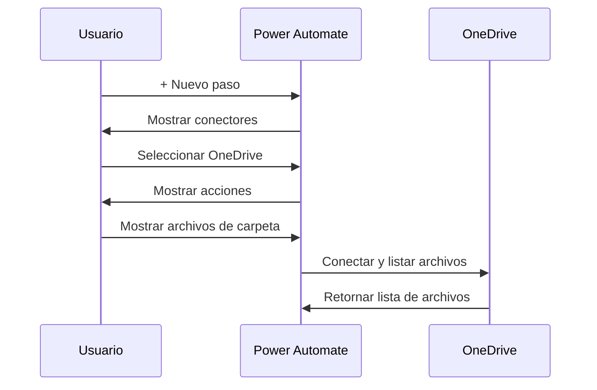
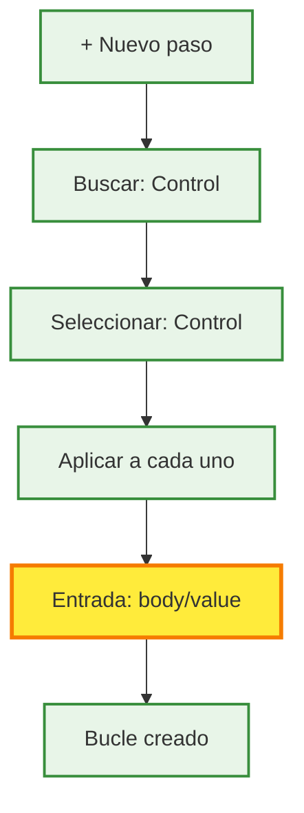
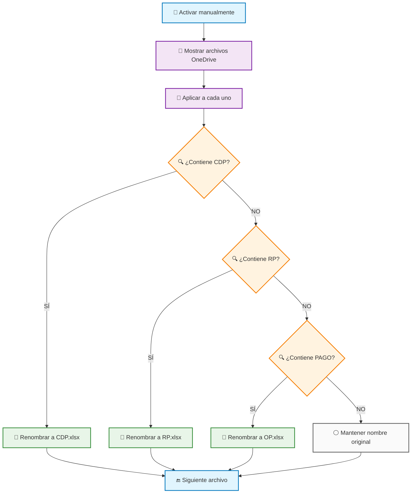
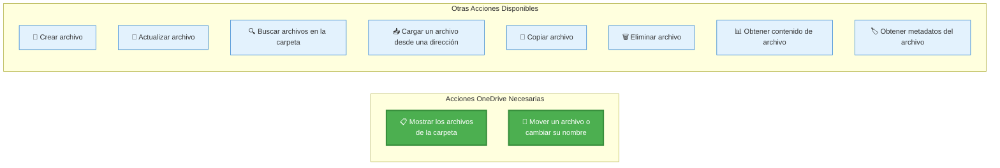

# Diagrama de Flujo Completo - Power Automate
## Renombrado Automático de Archivos de Presupuesto (OneDrive)

---

## 📋 CONFIGURACIÓN INICIAL DEL FLUJO

**Nombre del Flujo:** `Renombrar Archivos Presupuesto ADMIN`
**Tipo:** Flujo de nube automatizado
**Conector:** OneDrive para la Empresa
**Desencadenador:** Manual (botón) o Programado

---

## 🔄 DIAGRAMA DE FLUJO PRINCIPAL



---

## 🎯 DIAGRAMA DE LÓGICA DE RENOMBRADO



---

## 🛠️ PASOS DETALLADOS DE CONFIGURACIÓN EN POWER AUTOMATE

### **PASO 1: Crear el Flujo Base**
1. **Ir a Power Automate** → https://make.powerautomate.com
2. **Crear** → **Flujo automatizado**
3. **Nombre del flujo:** `Renombrar Archivos Presupuesto ADMIN`
4. **Elegir desencadenador:** `Activar manualmente un flujo`
5. **Hacer clic en:** `Crear`

```
✅ RESULTADO: Flujo creado con desencadenador manual
```



### **PASO 2: Agregar Acción OneDrive**
1. **Hacer clic en:** `+ Nuevo paso`
2. **En el buscador escribir:** `OneDrive`
3. **Seleccionar conector:** `OneDrive para la Empresa`
4. **Elegir acción:** `Mostrar los archivos de la carpeta`
5. **Configurar parámetros:**
   ```
   📁 Carpeta: Hacer clic en 📂 → Navegar hasta:
   /SENA/CDFPI/PRESUPUESTO/nuve/ADMIN/nueva
   ```
6. **Hacer clic en:** `Agregar`

```
✅ RESULTADO: Acción configurada para listar archivos de la carpeta
```



### **PASO 3: Crear Bucle "Aplicar a cada uno"**
1. **Hacer clic en:** `+ Nuevo paso`
2. **En el buscador escribir:** `Control`
3. **Seleccionar:** `Control` (icono de engranaje)
4. **Elegir acción:** `Aplicar a cada uno`
5. **Configurar entrada:**
   ```
   📋 Seleccionar una salida de los pasos anteriores:
   - Hacer clic en el campo de entrada
   - Seleccionar: body/value (de "Mostrar los archivos de la carpeta")
   ```

```
⚠️ CRÍTICO: Debes seleccionar "body/value", NO solo "value"
✅ RESULTADO: Bucle configurado para iterar sobre cada archivo
```



### **PASO 4: Primera Condición (CDP) - DENTRO del Bucle**

⚠️ **MUY IMPORTANTE:** Los siguientes pasos se hacen DENTRO del bucle "Aplicar a cada uno"

1. **Dentro del bucle, hacer clic en:** `+ Agregar una acción`
2. **En el buscador escribir:** `Control`
3. **Seleccionar:** `Control`
4. **Elegir acción:** `Condición`
5. **Configurar la condición:**
   ```
   🔍 Lado izquierdo: Hacer clic en 🧪 y escribir:
   contains(items('Apply_to_each')?['Name'], 'CDP')
   
   📊 Operador: seleccionar "es igual a"
   
   📝 Lado derecho: escribir: true
   ```

```
✅ RESULTADO: Condición creada para detectar archivos con "CDP"
```

### **PASO 5: Acción para Renombrar CDP - Rama "Sí"**
1. **En la rama "Sí" de la condición, hacer clic en:** `+ Agregar una acción`
2. **Buscar:** `OneDrive`
3. **Seleccionar:** `OneDrive para la Empresa`
4. **Elegir acción:** `Mover un archivo o cambiar su nombre`
5. **Configurar parámetros:**
   ```
   📄 Archivo: Hacer clic en 🧪 y escribir:
   items('Apply_to_each')?['Id']
   
   📁 Ruta de acceso del archivo de destino:
   /SENA/CDFPI/PRESUPUESTO/nuve/ADMIN/nueva/CDP.xlsx
   
   ❌ Sobrescribir: No (o false)
   ```

```
✅ RESULTADO: Archivos con "CDP" se renombrarán a "CDP.xlsx"
```

### **PASO 6: Segunda Condición (RP) - Rama "No" de CDP**
1. **En la rama "No" de la primera condición, hacer clic en:** `+ Agregar una acción`
2. **Buscar:** `Control`
3. **Seleccionar:** `Control`
4. **Elegir acción:** `Condición`
5. **Configurar la condición:**
   ```
   🔍 Lado izquierdo: Hacer clic en 🧪 y escribir:
   contains(items('Apply_to_each')?['Name'], 'RP')
   
   📊 Operador: seleccionar "es igual a"
   
   📝 Lado derecho: escribir: true
   ```

### **PASO 7: Acción para Renombrar RP - Rama "Sí"**
1. **En la rama "Sí" de esta segunda condición, hacer clic en:** `+ Agregar una acción`
2. **Buscar:** `OneDrive`
3. **Seleccionar:** `OneDrive para la Empresa`
4. **Elegir acción:** `Mover un archivo o cambiar su nombre`
5. **Configurar parámetros:**
   ```
   📄 Archivo: Hacer clic en 🧪 y escribir:
   items('Apply_to_each')?['Id']
   
   📁 Ruta de acceso del archivo de destino:
   /SENA/CDFPI/PRESUPUESTO/nuve/ADMIN/nueva/RP.xlsx
   
   ❌ Sobrescribir: No (o false)
   ```

### **PASO 8: Tercera Condición (PAGO) - Rama "No" de RP**
1. **En la rama "No" de la segunda condición, hacer clic en:** `+ Agregar una acción`
2. **Buscar:** `Control`
3. **Seleccionar:** `Control`
4. **Elegir acción:** `Condición`
5. **Configurar la condición:**
   ```
   🔍 Lado izquierdo: Hacer clic en 🧪 y escribir:
   contains(items('Apply_to_each')?['Name'], 'PAGO')
   
   📊 Operador: seleccionar "es igual a"
   
   📝 Lado derecho: escribir: true
   ```

### **PASO 9: Acción para Renombrar OP - Rama "Sí"**
1. **En la rama "Sí" de esta tercera condición, hacer clic en:** `+ Agregar una acción`
2. **Buscar:** `OneDrive`
3. **Seleccionar:** `OneDrive para la Empresa`
4. **Elegir acción:** `Mover un archivo o cambiar su nombre`
5. **Configurar parámetros:**
   ```
   📄 Archivo: Hacer clic en 🧪 y escribir:
   items('Apply_to_each')?['Id']
   
   📁 Ruta de acceso del archivo de destino:
   /SENA/CDFPI/PRESUPUESTO/nuve/ADMIN/nueva/OP.xlsx
   
   ❌ Sobrescribir: No (o false)
   ```

### **PASO 10: Dejar rama "No" vacía**
En la rama "No" de la tercera condición (PAGO), **NO agregar ninguna acción**. Esto permite que los archivos que no cumplen ninguna regla mantengan su nombre original.

```
✅ RESULTADO FINAL: Flujo completo con condiciones anidadas
```

## 🎯 **ESTRUCTURA VISUAL FINAL DEL FLUJO**



---

## 🔧 EXPRESIONES Y CONFIGURACIONES ESPECÍFICAS

### **🧪 Expresiones que debes copiar exactamente:**

#### **Para las condiciones (copiar en el campo de expresión):**
```javascript
// Condición 1 - CDP:
contains(items('Apply_to_each')?['Name'], 'CDP')

// Condición 2 - RP:
contains(items('Apply_to_each')?['Name'], 'RP')

// Condición 3 - PAGO:
contains(items('Apply_to_each')?['Name'], 'PAGO')
```

#### **Para las acciones de renombrar (campo "Archivo"):**
```javascript
// En todas las acciones "Mover un archivo":
items('Apply_to_each')?['Id']
```

#### **Para las rutas de destino (copiar exactamente):**
```
/SENA/CDFPI/PRESUPUESTO/nuve/ADMIN/nueva/CDP.xlsx
/SENA/CDFPI/PRESUPUESTO/nuve/ADMIN/nueva/RP.xlsx
/SENA/CDFPI/PRESUPUESTO/nuve/ADMIN/nueva/OP.xlsx
```

### **🎯 Pasos para insertar expresiones:**
1. **Hacer clic en el botón 🧪** (icono de expresión)
2. **Copiar y pegar** la expresión exacta
3. **Hacer clic en:** `Aceptar`

### **⚠️ Errores comunes a evitar:**
- ❌ **NO uses** `{FullPath}` → **USA** `Id`
- ❌ **NO olvides** las comillas simples en las expresiones
- ❌ **NO agregues** espacios extra en las expresiones
- ❌ **NO uses** `body/value` en las condiciones → **USA** las expresiones completas

---

## ✅ VALIDACIÓN Y PRUEBAS DEL FLUJO

### **🧪 PASO 11: Guardar y Probar el Flujo**
1. **Hacer clic en:** `Guardar` (esquina superior derecha)
2. **Esperar confirmación:** "Flujo guardado correctamente"
3. **Hacer clic en:** `Probar` 
4. **Seleccionar:** `Manualmente`
5. **Hacer clic en:** `Guardar y probar`
6. **Hacer clic en:** `Ejecutar flujo`
7. **Hacer clic en:** `Listo`

### **📊 Verificar Resultados:**
1. **Ir a la carpeta OneDrive:** `/SENA/CDFPI/PRESUPUESTO/nuve/ADMIN/nueva`
2. **Verificar que los archivos se renombraron correctamente:**
   - Archivos con "CDP" → `CDP.xlsx`
   - Archivos con "RP" → `RP.xlsx`  
   - Archivos con "PAGO" → `OP.xlsx`
   - Otros archivos → Sin cambios

### **🔍 Verificar Historial de Ejecución:**
1. **En Power Automate, ir a:** `Mis flujos`
2. **Hacer clic en tu flujo:** `Renombrar Archivos Presupuesto ADMIN`
3. **Ver historial de ejecución**
4. **Verificar que todas las acciones muestren:** ✅ Correcto

### **🚨 Solución de Problemas Comunes:**

#### **Error: "Apply_to_each referenced by inputs are not defined"**
**Causa:** Condiciones creadas fuera del bucle
**Solución:** Eliminar condiciones mal ubicadas y recrearlas DENTRO del "Aplicar a cada uno"

#### **Error: "File not found" o "Invalid path"**
**Causa:** Ruta de OneDrive incorrecta
**Solución:** Verificar que la ruta existe y tienes permisos de escritura

#### **Error: "Expression evaluation failed"**
**Causa:** Expresión mal escrita
**Solución:** Copiar exactamente las expresiones de esta documentación

## 🎯 CHECKLIST FINAL DE VALIDACIÓN

### **Antes de ejecutar:**
- [ ] ✅ Flujo tiene exactamente 3 elementos principales
- [ ] ✅ "Aplicar a cada uno" usa entrada `body/value`
- [ ] ✅ Todas las condiciones están DENTRO del bucle
- [ ] ✅ Expresiones copiadas exactamente como se muestra
- [ ] ✅ Rutas de destino incluyen el nombre del archivo completo
- [ ] ✅ Campo "Archivo" usa `items('Apply_to_each')?['Id']`

### **Después de ejecutar:**
- [ ] ✅ Flujo se ejecutó sin errores
- [ ] ✅ Archivos se renombraron correctamente
- [ ] ✅ Archivos sin reglas mantuvieron nombre original
- [ ] ✅ No se crearon archivos duplicados

Basado en las opciones que mostraste, aquí están las acciones exactas que necesitamos:

### **ACCIONES QUE USAREMOS EN NUESTRO FLUJO:**



### **1. "Mostrar los archivos de la carpeta"**
```
┌─────────────────────────────────────────────────────────────┐
│ 🎯 PROPÓSITO: Obtener lista de archivos de una carpeta     │
│                                                             │
│ 📍 CONFIGURACIÓN:                                          │
│   ├─ Carpeta: /SENA/CDFPI/PRESUPUESTO/nuve/ADMIN/nueva    │
│   └─ Resultado: Array "value" con información de archivos  │
│                                                             │
│ 📤 SALIDA: Lista de archivos con propiedades:             │
│   ├─ Name: Nombre del archivo                              │
│   ├─ FullPath: Ruta completa                              │
│   ├─ Id: Identificador único                              │
│   ├─ Size: Tamaño del archivo                             │
│   └─ LastModified: Fecha de modificación                  │
└─────────────────────────────────────────────────────────────┘
```

### **2. "Mover un archivo o cambiar su nombre"**
```
┌─────────────────────────────────────────────────────────────┐
│ 🎯 PROPÓSITO: Renombrar o mover archivos                   │
│                                                             │
│ 📍 CONFIGURACIÓN:                                          │
│   ├─ Archivo: [Expresión] items('Apply_to_each')?['{FullPath}'] │
│   ├─ Carpeta de destino: /SENA/CDFPI/PRESUPUESTO/nuve/ADMIN/nueva │
│   └─ Nuevo nombre: CDP.xlsx (o RP.xlsx, OP.xlsx)          │
│                                                             │
│ ⚠️ IMPORTANTE:                                             │
│   ├─ Si cambias solo el nombre, mantén la misma carpeta   │
│   ├─ Si existe archivo con mismo nombre, puede fallar     │
│   └─ OneDrive mantiene versiones anteriores               │
└─────────────────────────────────────────────────────────────┘
```

---

## 📝 ACCIONES COMPLETAS DE ONEDRIVE DISPONIBLES

Aquí tienes **todas las acciones disponibles** en OneDrive para la Empresa en Power Automate:

### **📁 GESTIÓN DE ARCHIVOS:**
- ✅ **"Mostrar los archivos de la carpeta"** ← **(USAMOS ESTA)**
- ✅ **"Mover un archivo o cambiar su nombre"** ← **(USAMOS ESTA)**
- 📄 "Crear archivo"
- 🔄 "Actualizar archivo"
- 🗑️ "Eliminar archivo"
- 📋 "Copiar archivo"

### **🔍 BÚSQUEDA Y NAVEGACIÓN:**
- 🔍 "Buscar archivos en la carpeta"
- 🔍 "Buscar archivos en la carpeta por ruta de acceso"
- 📁 "Mostrar los archivos de la carpeta raíz"

### **📤 CARGA Y DESCARGA:**
- ⬇️ "Cargar un archivo desde una dirección URL"
- 📊 "Obtener contenido de archivo"
- 📊 "Obtener contenido de archivo mediante ruta de acceso"

### **🔗 VÍNCULOS Y METADATOS:**
- 🔗 "Crear un vínculo para compartir"
- 🔗 "Crear un vínculo para compartir por ruta de acceso"
- 🏷️ "Obtener metadatos del archivo"
- 🏷️ "Obtener metadatos de archivo mediante ruta de acceso"
- 🖼️ "Obtener la miniatura del archivo"

### **🔄 CONVERSIÓN Y PROCESAMIENTO:**
- 🔄 "Convertir un archivo" (Vista previa)
- 🔄 "Convertir un archivo mediante una ruta de acceso" (Vista previa)
- 📦 "Extraer archivo a carpeta"

### **📂 OPERACIONES CON RUTAS:**
- 📝 "Copiar un archivo mediante una ruta de acceso"
- 📝 "Mover un archivo o cambiar su nombre mediante una ruta de acceso"

---

## ✅ CONFIRMACIÓN DE ACCIONES PARA NUESTRO FLUJO

Para nuestro flujo específico **solo necesitamos 2 acciones**:

### **1. 📋 "Mostrar los archivos de la carpeta"**
```
🎯 Propósito: Obtener lista de todos los archivos en la carpeta
📍 Configuración: Especificar ruta de la carpeta
📤 Salida: Array "value" con información de cada archivo
```

### **2. 📝 "Mover un archivo o cambiar su nombre"**
```
🎯 Propósito: Renombrar archivos específicos
📍 Configuración: 
   ├─ Archivo: Ruta del archivo actual
   ├─ Carpeta de destino: Misma carpeta (para renombrar)
   └─ Nuevo nombre: CDP.xlsx, RP.xlsx, OP.xlsx
```

### **🚫 Acciones que NO necesitamos:**
- ❌ "Buscar archivos en la carpeta" (ya tenemos la lista completa)
- ❌ "Obtener metadatos" (ya incluidos en "Mostrar archivos")
- ❌ "Crear archivo" (solo renombramos existentes)
- ❌ "Eliminar archivo" (solo cambiamos nombres)

---
