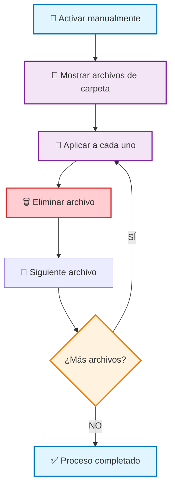

# Eliminar Archivos de OneDrive con Power Automate
## Guía Completa Paso a Paso

---

## 🎯 **Objetivo**
Crear un flujo de Power Automate para **eliminar archivos** de una carpeta específica en OneDrive para la Empresa de forma automatizada y segura.

## ⚠️ **ADVERTENCIAS IMPORTANTES**
- 🚨 **PELIGRO:** La eliminación de archivos es **IRREVERSIBLE** (van a la papelera por 30-90 días)
- 🔒 **RESPALDO:** Siempre hacer backup antes de ejecutar flujos de eliminación
- 🧪 **PRUEBAS:** Probar primero con archivos de prueba, nunca con datos importantes
- 📁 **PERMISOS:** Verificar que tienes permisos de eliminación en la carpeta

---

## 🛠️ **PASOS DETALLADOS DE CONFIGURACIÓN**

### **PASO 1: Crear el Flujo Base**
1. **Ir a Power Automate** → https://make.powerautomate.com
2. **Crear** → **Flujo automatizado**
3. **Nombre del flujo:** `Eliminar Archivos OneDrive ADMIN`
4. **Elegir desencadenador:** `Activar manualmente un flujo`
5. **Hacer clic en:** `Crear`

```
✅ RESULTADO: Flujo creado con desencadenador manual
```

### **PASO 2: Listar Archivos de la Carpeta**
1. **Hacer clic en:** `+ Nuevo paso`
2. **En el buscador escribir:** `OneDrive`
3. **Seleccionar conector:** `OneDrive para la Empresa`
4. **Elegir acción:** `Mostrar los archivos de la carpeta`
5. **Configurar parámetros:**
   ```
   📁 Carpeta: Hacer clic en 📂 → Navegar hasta:
   /SENA/CDFPI/PRESUPUESTO/nuve/ADMIN/nueva
   ```

```
✅ RESULTADO: Acción configurada para obtener lista de archivos
```

### **PASO 3: Crear Bucle "Aplicar a cada uno"**
1. **Hacer clic en:** `+ Nuevo paso`
2. **En el buscador escribir:** `Control`
3. **Seleccionar:** `Control` (icono de engranaje)
4. **Elegir acción:** `Aplicar a cada uno`
5. **Configurar entrada:**
   ```
   📋 Seleccionar una salida de los pasos anteriores:
   - Hacer clic en el campo de entrada
   - Seleccionar: body/value (de "Mostrar los archivos de la carpeta")
   ```

```
⚠️ CRÍTICO: Debes seleccionar "body/value", NO solo "value"
✅ RESULTADO: Bucle configurado para iterar sobre cada archivo
```

### **PASO 4: Agregar Acción de Eliminación - DENTRO del Bucle**

⚠️ **MUY IMPORTANTE:** Este paso se hace DENTRO del bucle "Aplicar a cada uno"

1. **Dentro del bucle, hacer clic en:** `+ Agregar una acción`
2. **En el buscador escribir:** `OneDrive`
3. **Seleccionar:** `OneDrive para la Empresa`
4. **Elegir acción:** `Eliminar archivo`
5. **Configurar parámetros:**
   ```
   📄 Archivo: Hacer clic en 🧪 (expresión) y escribir:
   items('Apply_to_each')?['Id']
   ```

```
✅ RESULTADO: Cada archivo en la carpeta será eliminado
```

---

## 🔧 **CONFIGURACIÓN ESPECÍFICA CORRECTA**

### **🚨 ERRORES QUE VEO EN TUS CAPTURAS:**

#### **1. Error en el Campo "Archivo":**
```
❌ INCORRECTO: Name (como se ve en tu captura)
✅ CORRECTO: items('Apply_to_each')?['Id']
```

#### **2. Error en la Referencia del Archivo:**
- **En tu captura veo:** `Name` como valor del campo "Archivo"
- **Debe ser:** Una expresión que referencie el ID del archivo

### **🧪 Expresión Correcta para el Campo "Archivo":**
```javascript
items('Apply_to_each')?['Id']
```

### **📋 Pasos para Corregir tu Configuración:**
1. **Hacer clic en el campo "Archivo"** en tu acción "Eliminar archivo"
2. **Eliminar** el valor actual (`Name`)
3. **Hacer clic en el botón 🧪** (expresión)
4. **Escribir exactamente:** `items('Apply_to_each')?['Id']`
5. **Hacer clic en:** `Aceptar`

---

## 🎯 **ESTRUCTURA VISUAL DEL FLUJO CORRECTO**



---

## 🛡️ **VERSIÓN SEGURA CON CONDICIONES**

### **ELIMINAR SOLO ARCHIVOS ESPECÍFICOS**

Si quieres eliminar solo ciertos archivos (por ejemplo, solo archivos antiguos o con nombres específicos):

#### **PASO 4 ALTERNATIVO: Agregar Condición Antes de Eliminar**
1. **Dentro del bucle, hacer clic en:** `+ Agregar una acción`
2. **Buscar:** `Control`
3. **Elegir acción:** `Condición`
4. **Configurar condición de ejemplo:**
   ```
   🔍 Lado izquierdo: Hacer clic en 🧪 y escribir:
   contains(items('Apply_to_each')?['Name'], '.tmp')
   
   📊 Operador: seleccionar "es igual a"
   
   📝 Lado derecho: escribir: true
   ```

#### **PASO 5: Eliminar Solo en Rama "Sí"**
1. **En la rama "Sí" de la condición:**
   - Agregar acción: `OneDrive para la Empresa`
   - Acción: `Eliminar archivo`
   - Archivo: `items('Apply_to_each')?['Id']`

2. **En la rama "No":**
   - No agregar ninguna acción (mantener archivos)

```
✅ RESULTADO: Solo elimina archivos que cumplan la condición
```

---

## 🧪 **EXPRESIONES ÚTILES PARA CONDICIONES**

### **Eliminar archivos por extensión:**
```javascript
// Solo archivos .tmp
contains(items('Apply_to_each')?['Name'], '.tmp')

// Solo archivos .log
contains(items('Apply_to_each')?['Name'], '.log')

// Solo archivos .bak
contains(items('Apply_to_each')?['Name'], '.bak')
```

### **Eliminar archivos por fecha:**
```javascript
// Archivos anteriores a una fecha específica
less(items('Apply_to_each')?['LastModified'], '2025-01-01')

// Archivos más antiguos de 30 días
less(items('Apply_to_each')?['LastModified'], addDays(utcNow(), -30))
```

### **Eliminar archivos por nombre:**
```javascript
// Archivos que contienen "temp"
contains(toLower(items('Apply_to_each')?['Name']), 'temp')

// Archivos que empiezan con "backup_"
startsWith(items('Apply_to_each')?['Name'], 'backup_')
```

---

## ⚠️ **MEDIDAS DE SEGURIDAD RECOMENDADAS**

### **1. 🧪 Prueba con Archivos de Ejemplo**
```
✅ Crear carpeta de prueba: /test_eliminacion
✅ Copiar 2-3 archivos no importantes
✅ Ejecutar flujo en carpeta de prueba primero
✅ Verificar que funciona correctamente
```

### **2. 📊 Agregar Logging/Notificaciones**
```
✅ Agregar acción "Enviar correo" al final
✅ Incluir contador de archivos eliminados
✅ Registrar nombres de archivos eliminados
```

### **3. 🔒 Agregar Confirmación Manual**
```
✅ Usar desencadenador con parámetros de entrada
✅ Agregar paso de confirmación antes de eliminar
✅ Incluir validación de carpeta correcta
```

---

## ✅ **CHECKLIST DE VALIDACIÓN**

### **Antes de ejecutar:**
- [ ] ✅ Flujo probado en carpeta de prueba
- [ ] ✅ Backup de archivos importantes realizado
- [ ] ✅ Campo "Archivo" usa expresión `items('Apply_to_each')?['Id']`
- [ ] ✅ Bucle "Aplicar a cada uno" usa entrada `body/value`
- [ ] ✅ Permisos de eliminación verificados
- [ ] ✅ Ruta de carpeta correcta confirmada

### **Durante la ejecución:**
- [ ] ✅ Monitorear el progreso en tiempo real
- [ ] ✅ Verificar que no hay errores en el historial
- [ ] ✅ Confirmar que solo se eliminan archivos esperados

### **Después de ejecutar:**
- [ ] ✅ Verificar carpeta OneDrive (archivos eliminados)
- [ ] ✅ Revisar papelera de reciclaje OneDrive
- [ ] ✅ Confirmar que archivos importantes se mantuvieron
- [ ] ✅ Documentar resultado de la operación

---

## 🚨 **SOLUCIÓN DE PROBLEMAS COMUNES**

### **Error: "File not found"**
**Causa:** Expresión incorrecta en campo "Archivo"
**Solución:** Usar `items('Apply_to_each')?['Id']` en lugar de `Name`

### **Error: "Access denied"**
**Causa:** Sin permisos de eliminación
**Solución:** Verificar permisos en OneDrive para la carpeta

### **Error: "Apply_to_each referenced by inputs are not defined"**
**Causa:** Acción "Eliminar archivo" fuera del bucle
**Solución:** Mover la acción DENTRO del "Aplicar a cada uno"

### **Error: "Expression evaluation failed"**
**Causa:** Expresión mal escrita
**Solución:** Copiar exactamente: `items('Apply_to_each')?['Id']`

---

## 🎯 **RESUMEN EJECUTIVO**

**Para eliminar archivos correctamente en OneDrive con Power Automate:**

1. **📁 Listar archivos** con "Mostrar los archivos de la carpeta"
2. **🔄 Iterar** con "Aplicar a cada uno" usando `body/value`
3. **🗑️ Eliminar** con "Eliminar archivo" usando `items('Apply_to_each')?['Id']`
4. **🛡️ Seguridad** siempre probar primero y hacer backups

**¡El error principal en tu flujo es usar `Name` en lugar de `Id` en el campo "Archivo"!**
